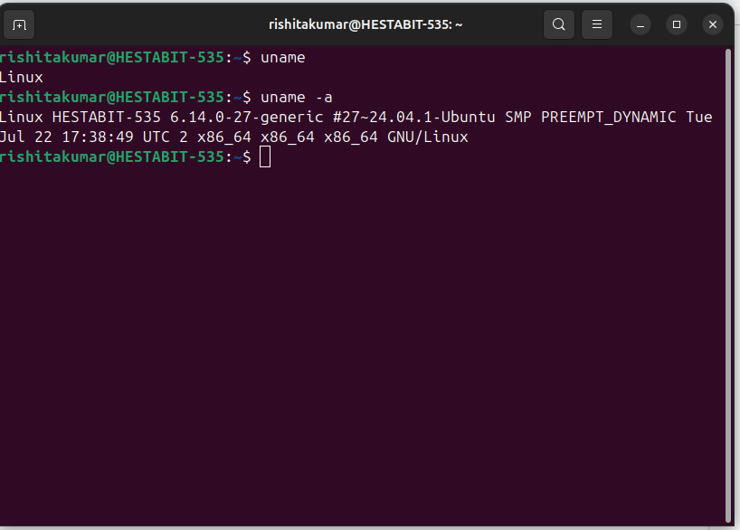
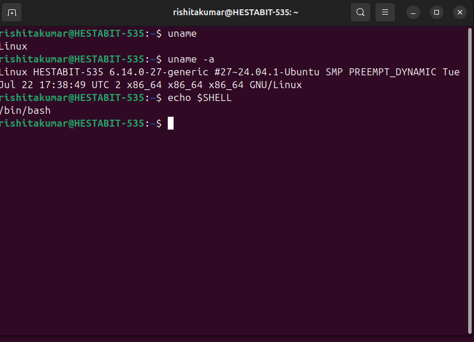
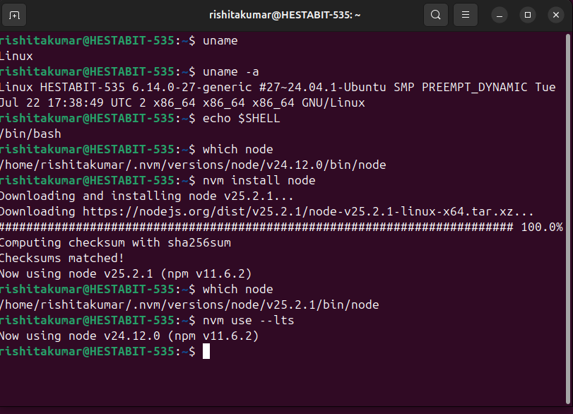
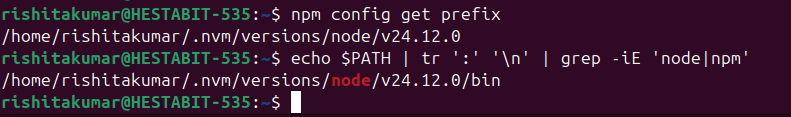
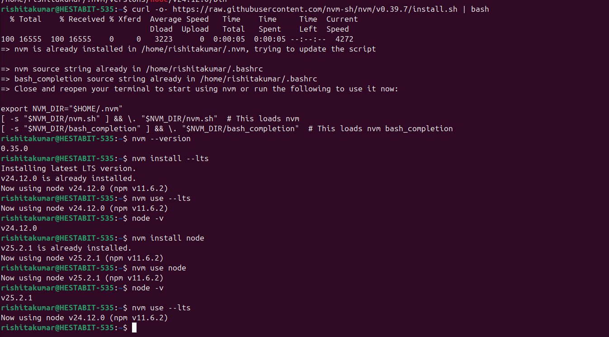
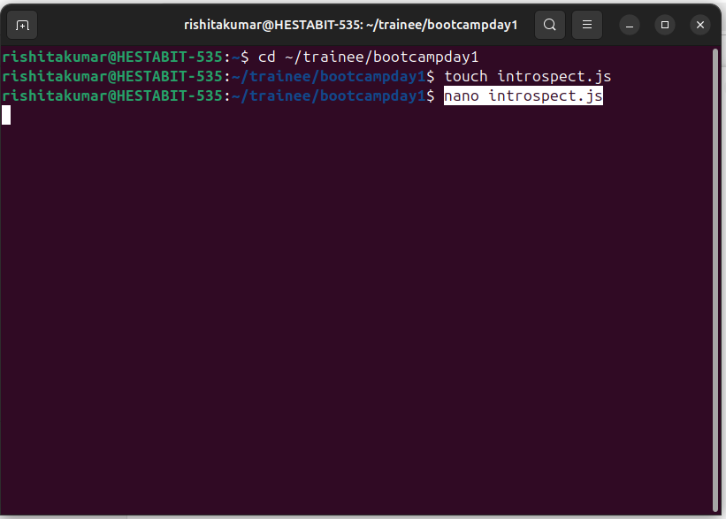
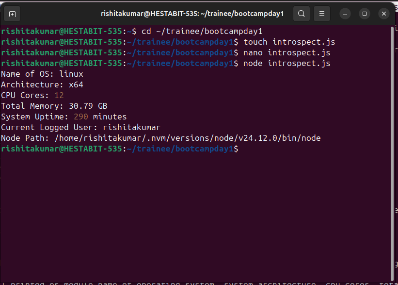
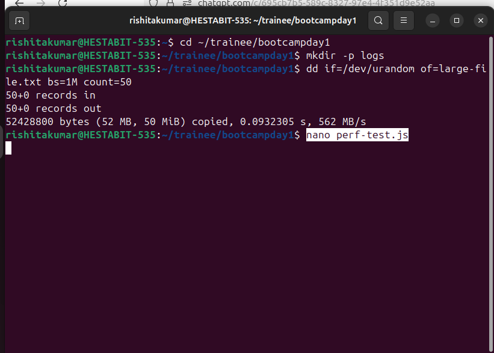
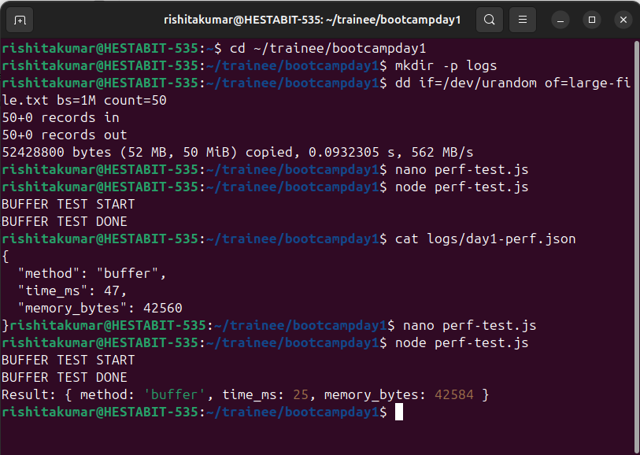
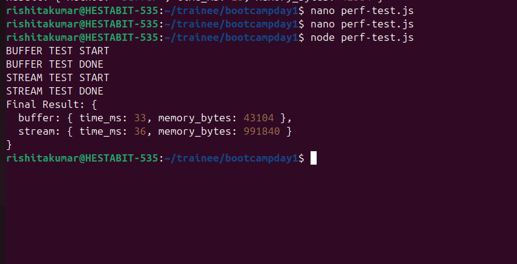

# DAY 1 — SYSTEM REVERSE ENGINEERING + NODE & TERMINAL MASTERING

## Tasks
**(NO GUI allowed — only terminal)**

---

## Understanding System Reverse Engineering

### Understanding basics

Operating Systen is the core software that manages hardware, memory, CPU, file and allows different application to run.

OS is important because it is able to handle different processes and memory differently.

##Task1

Understanding different commands-

1. uname
First, we are using uname command to display OS name.

2. uname -a
uname means Unix Name
-a means all
This command is used to identify the os,version of kernel, and the architecture. 
Output-
Linux HESTABIT-535 6.14.0-27-generic #27~24.04.1-Ubuntu SMP PREEMPT_DYNAMIC Tue Jul 22 17:38:49 UTC 2 x86_64 x86_64 x86_64 GNU/Linux

3.echo $SHELL

This determines shell behaviour means how the shell interprets and executes all the commands, and environment variables.
 output:
/bin/bash

4. which node
nvm install node command
nvm use --lts command

which node command confirms the node installation and tells us which node version is active and it also shows that Node.js is managed via NVM (Node Version Manager) which allows switching between different node versions safely.

The nvm install node command installs the latest available Node.js version (v25.2.1).

After installation, Node.js switches to version v25.2.1.

The nvm use --lts command switches the active Node.js version to the Long Term Support (LTS) release (v24.12.0).

5. npm config get prefix
he command npm config get prefix is used to check the location where npm installs global packages. Whenever we install a package globally using npm install -g, npm stores it in a specific directory called the prefix. By running this command, we can see that directory and understand where our global npm tools are coming from. This is helpful to avoid permission issues and to make sure npm is using the correct setup, especially when Node.js is managed using NVM. We write this command to clearly understand our environment and ensure everything is configured properly.

6. echo $PATH | tr ':' '\n' | grep -iE 'node|npm'
so we are using this command as it takes the system’s PATH (which is just a list of folders where Linux looks for commands), splits it so each folder appears on a new line, and then shows only the folders that are related to node or npm. We write this to make sure the system is using the correct Node.js and npm installation, especially when tools like NVM are used. This helps avoid confusion between different Node versions and ensures that when you run node or npm, the correct one is being used. 

output-/home/rishitakumar/.nvm/versions/node/v24.12.0/bin

Compiling the above information:

1. Identify and document:
OS version- Ubuntu 24.04.1(Linux)
Architecture: x86_64
Kernel: 6.14.0
Current shell (bash/zsh/powershell): /bin/bash
Node binary path (which node):/home/rishitakumar/.nvm/versions/node/v24.12.0/bin/node
NPM global installation path:<pre>/home/rishitakumar/.nvm/versions/node/v24.12.0</pre>
All PATH entries that include "node" or "npm":/home/rishitakumar/.nvm/versions/node/v24.12.0/bin

##Task2

2. Install & use NVM (Node Version Manager)
Install NVM
Switch Node from LTS → Latest and back

Running the following command to install NVM
curl -o- https://raw.githubusercontent.com/nvm-sh/nvm/v0.39.7/install.sh | bash

Verifying that NVM is installed:
nvm --version
0.35.0

In this task, I installed and used NVM (Node Version Manager) to manage different versions of Node.js using the terminal. First, I ran the NVM install command, and the system showed that NVM was already installed on my machine. Then I checked the NVM version to make sure it was working properly. After that, I installed the LTS (Long Term Support) version of Node.js and switched to it using NVM. I verified the Node version to confirm the change. Next, I installed the latest version of Node.js and switched to it to see how NVM allows easy version switching. Finally, I switched back to the LTS version again. This task helped me understand how NVM makes it easy to install, switch, and manage multiple Node.js versions without affecting the system setup.

We are doing this to manage multiple Node.js versions easily. We can use the latest version for testing new features and switch back to the LTS version for stable development.

##Task3

3. Create script introspect.js that prints:
OS:
Architecture:
CPU Cores:
Total Memory:
System Uptime:
Current Logged User:
Node

First, I moved into my working directory where I am doing all Day-1 tasks,then I created a new JavaScript file named introspect.js using the terminal. After creating the file, I opened it in the terminal using nano editor so I can write code inside it.

Inside the file, first I imported Node.js built-in os module, this module helps us to get system-level information like OS, CPU, memory, etc

Then I printed os module,name of operating system, system architecture, cpu cores, total memory etc,then, I executed the script using Node.js.

rishitakumar@HESTABIT-535:~/trainee/bootcampday1$ node introspect.js

Output- 
Name of OS: linux
Architecture: x64
CPU Cores: 12
Total Memory: 30.79 GB
System Uptime: 290 minutes
Current Logged User: rishitakumar
Node Path: /home/rishitakumar/.nvm/versions/node/v24.12.0/bin/node
rishitakumar@HESTABIT-535:~/trainee/bootcampday1$ 

## Task 4

4. STREAM vs BUFFER exercise (performance benchmark)
Create a large test file (50MB+)
Read file using both:
fs.readFile (Buffer)
Stream (fs.createReadStream)
Capture execution time + memory usage

First I am creating a folder to store logs. Then I am creating a large test file.
Then i am creating a new file perf-test.js, and inside perf-test.js I am writing the buffer(fs.readFile) code
In BUFFER,the whole file is loaded into memory at once, which uses more RAM.

In this code, I use fs.readFile to read a large file. This method reads the entire file at once and loads it completely into memory. First, I import the fs module so I can work with files in Node.js. Before reading the file, I record the start time and the memory usage of the system. Then I use fs.readFile to read the full file in one go. After the file is read, I again check the end time and memory usage. By comparing the start and end values, I calculate how much time and memory were used. Finally, I save these performance results in a JSON file. This approach is easy to implement, but it consumes more memory, especially when the file size is large.
Now I am running the buffer test

node perf-test.js

Now we are opening the perf-test.js again to edit and add the STREAM test now.

In this performance test, I first measured the buffer method, which reads the entire file into memory at once. After that test completed, I ran the stream method, which reads the file in smaller chunks. I stored both execution time and memory usage results in a single JSON file so that I could clearly compare the performance of buffer and stream approaches.

