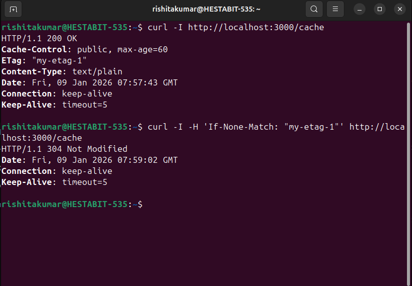
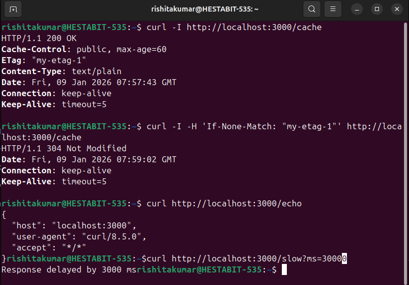

api-investigation.md
API Investigation — Day 4

While working on this task, I tried to understand what actually happens when an API request is made and how the server responds to it. Instead of just running commands, I focused on observing what changed and why.

I began by checking how my system finds the server. When I ran:

nslookup dummyjson.com

I saw that the domain name was converted into IP addresses. This made it clear that before any request reaches a server, the name has to be resolved into something machines understand. After that, I used:

traceroute dummyjson.com

This showed multiple network hops between my system and the server. It helped me realize that requests don’t go directly to a server but pass through many routers before reaching their destination.

Next, I used curl to fetch data from the API:

curl https://dummyjson.com/products

This returned a large list of products. When I modified the URL to:

curl -v "https://dummyjson.com/products?limit=5&skip=10"

the response changed. Only a small number of products were returned, and the starting point was different. From this, I understood that `limit` controls how many items are returned and `skip` controls where the data starts. This showed how APIs avoid sending large responses all at once.

Using curl with the verbose flag helped me notice request and response headers more clearly:

curl -v https://dummyjson.com/products

Headers felt like additional information sent along with the request. I experimented by sending a fake authorization header:

curl -H "Authorization: Bearer FAKE_TOKEN" https://dummyjson.com/products

The API still responded normally, which showed that this particular API does not enforce authentication. This helped me understand that headers only affect responses if the server is configured to check them.

Caching became clearer when I worked with ETags. First, I checked the headers using:

curl -I https://dummyjson.com/products?limit=5

I observed an ETag value in the response. Then I sent the same value back to the server using:

curl -v -H 'If-None-Match: W/"1cf6-vKLgOnINYP3dn8/IH5KH5MkT1tI"' https://dummyjson.com/products?limit=5

This time, the server responded with:

HTTP/2 304 Not Modified

No response body was sent. This showed that the server recognized the data had not changed and avoided sending it again, which helps save bandwidth and time.

Postman was also used to test the same requests. It made it easier to add headers manually and clearly see status codes and response headers. Using Postman helped confirm what I had already observed using curl.

Finally, I created a small Node.js server to understand server-side behavior. I added endpoints like `/echo` to return request headers, `/slow?ms=3000` to delay responses, and `/cache` to send cache-related headers and an ETag. Running the server with:

node server.js

and testing these endpoints using curl showed how a server decides whether to return a full response or a `304 Not Modified` based on request headers.

All POSTMAN SS ARE IN SCREENSHOT FOLDER.
