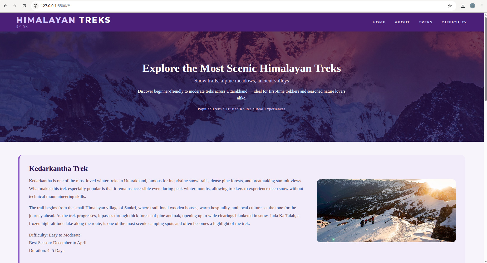
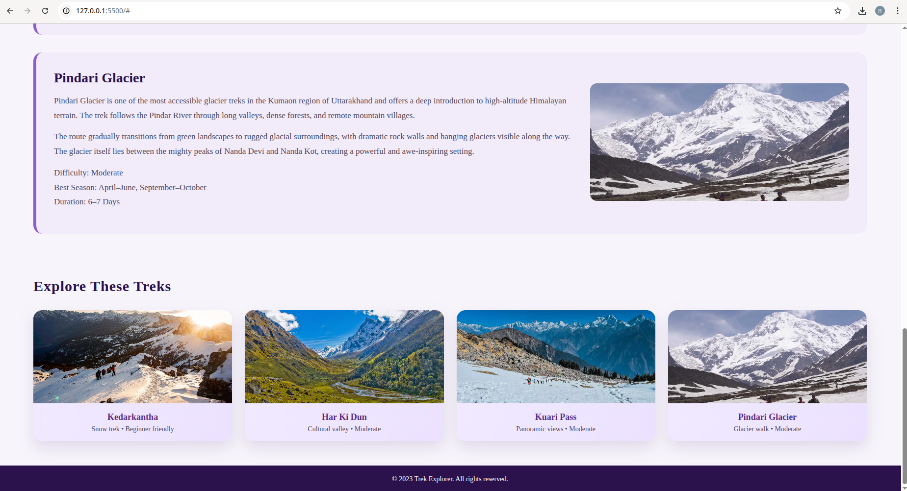

# Himalayan Treks – Trek Explorer Page

## Overview

This project is a static webpage built as part of the HTML & CSS layout assignment.  
The goal was to recreate the given layout structure using semantic HTML and basic CSS layout concepts.

The theme chosen for the page is **Himalayan trekking routes in Uttarakhand**, focusing on popular beginner to moderate treks.

---

## Assignment Layout Reference

The reference layout provided in the assignment included the following sections:

- Header
- Menu
- Hero section
- Main content area
- Image / Extra section
- Banner (footer)

This structure was followed while designing the page.

---

## My Implementation

I translated the abstract layout into a real-world website by mapping each block to a meaningful section.

### Layout Mapping
## Layout Mapping

- **Header**
  - Implemented as the site title **“Himalayan Treks by RK”** placed on the left side of the top bar.

- **Menu**
  - Implemented as a navigation bar with links: Home, About, Treks, and Difficulty.
  - Positioned on the right side of the header.

- **Hero Section**
  - Implemented as a full-width hero section with a background mountain image.
  - Contains the main heading, subheading, and a short description.

- **Main Section**
  - Implemented using multiple `<article>` elements.
  - Displays detailed information about treks such as Kedarkantha, Har Ki Dun, Kuari Pass, and Pindari Glacier.

- **Image / Extra Section**
  - Implemented using trek images alongside text.
  - An additional card-based section is added below the main content to summarize treks visually.

- **Banner (Footer)**
  - Implemented as a footer at the bottom of the page.
  - Displays copyright information.

---

## Screenshots Comparison

### Given Assignment Layout

### My Implemented Page

---

##Layout achieved through:

### Header + Menu
- Implemented using a `<header>` element
- Flexbox used to align logo on the left and menu on the right

### Hero Section
- Full-width section with background image
- Text centered using Flexbox
- Semi-transparent overlay applied using a linear gradient

### Main Content
- Each trek is wrapped inside an `<article>` element
- Text and image aligned side-by-side using Flexbox
- Maintains readability and structure

### Extra Section (Cards)
- A grid of trek cards added below the main content
- Uses CSS Grid for equal-width cards
- This section visually represents the “extra” block from the assignment layout

### Footer (Banner)
- Simple footer at the bottom
- Matches the banner section shown in the layout reference

---

## Learnings

- How to convert a block-based layout diagram into a real webpage
- Proper use of semantic HTML elements
- Using Flexbox and Grid for layout positioning
- Structuring content for readability
- Separating content (HTML) and presentation (CSS)

---

## Tools Used

- HTML5
- CSS3
- Google Fonts
- Local images

---

## Conclusion

This project helped me understand how to interpret a layout diagram and build a structured webpage using HTML and CSS.  
The focus was on layout clarity, semantic structure, and clean organization rather than visual effects.
