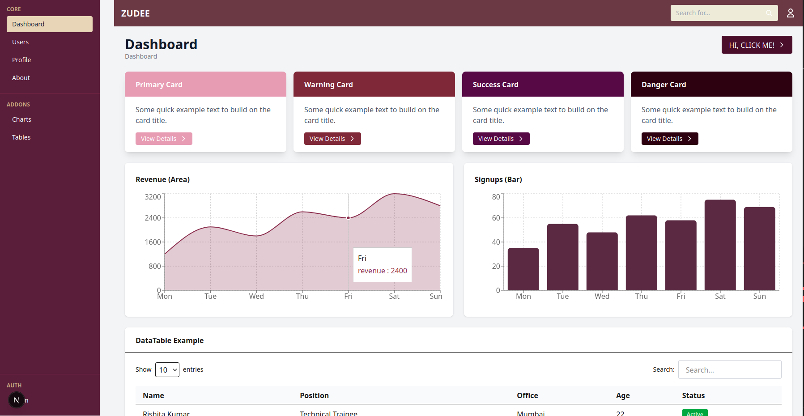
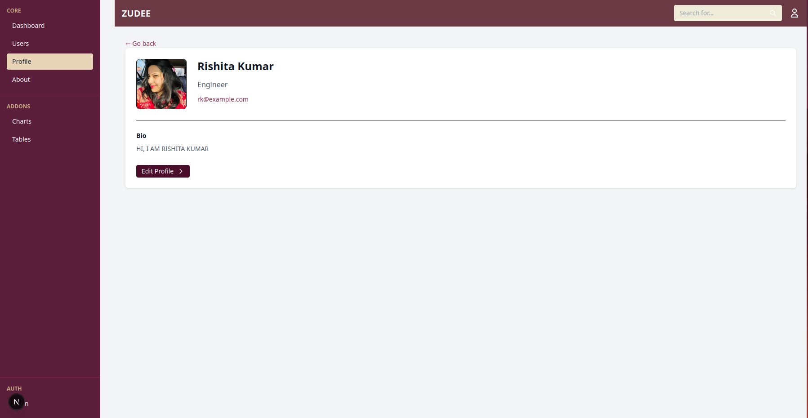

# Week 3 – Advanced Frontend (Next.js + Tailwind CSS)

This project is a frontend-only web application built using Next.js (App Router) and Tailwind CSS. The purpose of building this project was to practice creating modern user interfaces, designing reusable components, working with routing and layouts, and building a small admin-style dashboard experience.

The application focuses purely on the user interface. No backend or database is used. All data displayed on the pages is static or mocked.

---

## Landing Page

The landing page is designed like a SaaS product homepage. It contains a hero section with a main heading, description, and call-to-action button. Below that, a features section highlights key benefits of the platform. A testimonials section displays sample user feedback, and a footer appears at the bottom.

The landing page is fully responsive and includes subtle animations using Framer Motion and Tailwind CSS transitions. Images are rendered using Next.js Image component.


---

## About Page

The about page provides a short introduction to the platform, including a brief description, mission, and vision. The layout is simple, clean, and centered so that the content remains readable and professional.


---

## Login Page

The login page contains a static login form with username and password inputs, a remember-me checkbox, and a login button. The page is centered both vertically and horizontally and uses reusable Input and Button components.


---

## Dashboard Home

The dashboard home page shows summary cards at the top, followed by two charts and a data table. The page uses a shared dashboard layout that includes a navbar at the top and a sidebar on the left.

Cards display quick information, charts visualize dummy data, and the table lists sample user records with status badges.


---

## Charts

Two charts are displayed on the dashboard:

- Area Chart representing revenue
- Bar Chart representing user signups

These charts are implemented using the Recharts library with static dummy data.



---

## Users Listing Page

The users page displays a table of users with columns such as name, role, office, age, and status. Status values are shown using Badge components. The table is responsive and scrollable on smaller screens.


---

## Profile Page

The profile page displays a user photo, name, position, email, and a short bio. The layout is minimal and focuses only on essential information.



---

## Reusable Components

A reusable component system is created and used throughout the project. Components such as Button, Input, Card, Badge, Modal, Navbar, and Sidebar are reused across pages to keep the UI consistent and reduce repetition.

---

## Styling and Responsiveness

All styling is done using Tailwind CSS utility classes. Flexbox and Grid are used for layout. Responsive breakpoints ensure the application works well on mobile, tablet, and desktop devices. A consistent wine/maroon color theme is used across all pages.

---

## Image Optimization

All images are placed inside the public folder and rendered using the Next.js Image component for optimized loading and responsive sizing.

---

## Animations

Framer Motion is used for small entrance animations on the landing page. Tailwind transition and hover utilities are used for interactive effects across buttons and cards.

---

## What I Learned

While building this project, I learned how to work with the Next.js App Router, create nested layouts, design reusable UI components, build responsive layouts using Tailwind CSS, integrate charts into React components, and organize a multi-page frontend application.

---

## How To Run The Project

Install dependencies:

```bash
npm install
