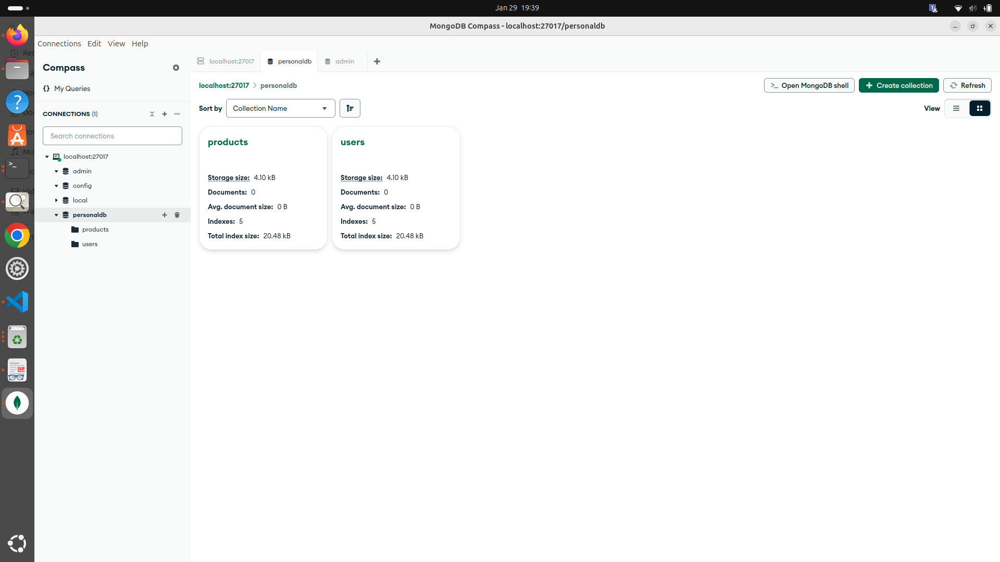
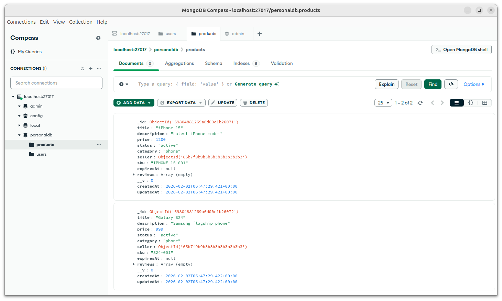
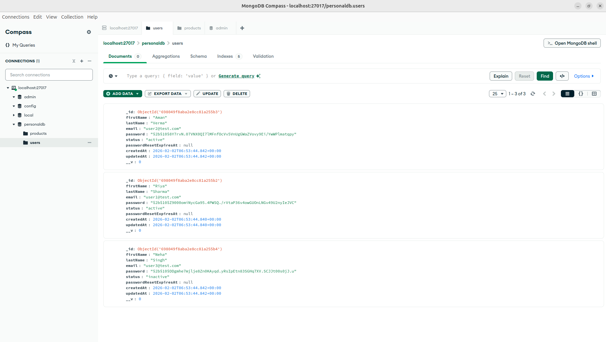
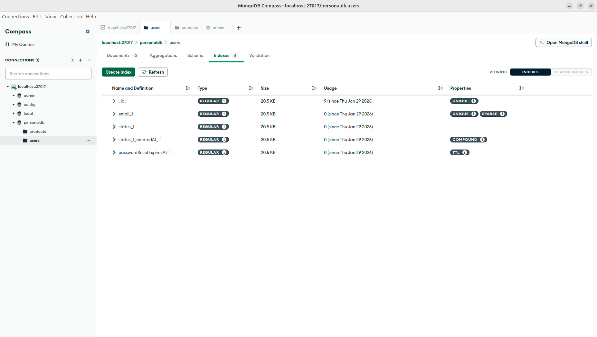
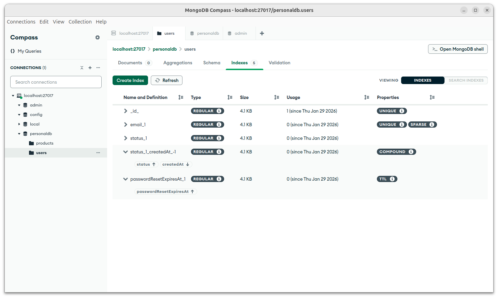

# Day 2 — Database Modeling & Repository Pattern

## Objective
The goal of Day 2 was to design efficient database schemas using MongoDB and implement a clean Repository Pattern for scalable backend architecture.

---

## What is Database Modeling?

Database modeling is the process of structuring data in a way that ensures:
- Efficient storage
- Fast querying
- Scalability
- Data consistency

In this project, MongoDB with Mongoose was used to design schemas for User and Product.

---

## Why Database Modeling Matters

- Improves query performance using indexes  
- Ensures data validation and integrity  
- Supports scalable backend systems  
- Reduces redundancy  

---

## Implementation Overview

### User Schema
- Stores user-related data  
- Includes validation for fields  
- Supports indexing for optimized queries  

### Product Schema
- Stores product details  
- Includes pricing, status, timestamps  
- Optimized using indexes and TTL  

---

## Repository Pattern

The repository pattern abstracts database logic from business logic.

### Benefits:
- Clean separation of concerns  
- Reusable database logic  
- Easier testing and maintenance  

### Implemented Repositories:
- user.repository.js
- product.repository.js

### Common Methods:
- Create
- Find by ID
- Update
- Delete
- Pagination

---

## Indexing & Optimization

### Types of Indexes Used:
- Compound Index  
- TTL (Time-To-Live) Index  
- Query-based Indexing  

### Benefits:
- Faster queries  
- Auto-expiry of data (TTL)  
- Better performance at scale  

---

## Database Screenshots

### MongoDB Database Overview

### Products Collection

### Users Collection

### Users Index

### Products TTL Index

### TTL Example

---

## Key Learnings

- Designing scalable schemas using MongoDB  
- Implementing indexing for performance optimization  
- Using TTL indexes for automatic data expiration  
- Applying repository pattern for clean architecture  

---

## Conclusion

Day 2 focused on building a strong database foundation with optimized schemas and clean data access layers, which are essential for scalable backend applications.
