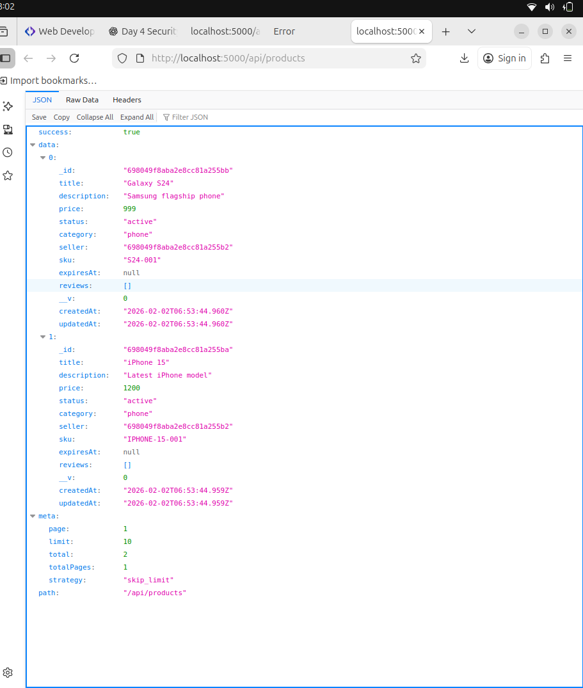
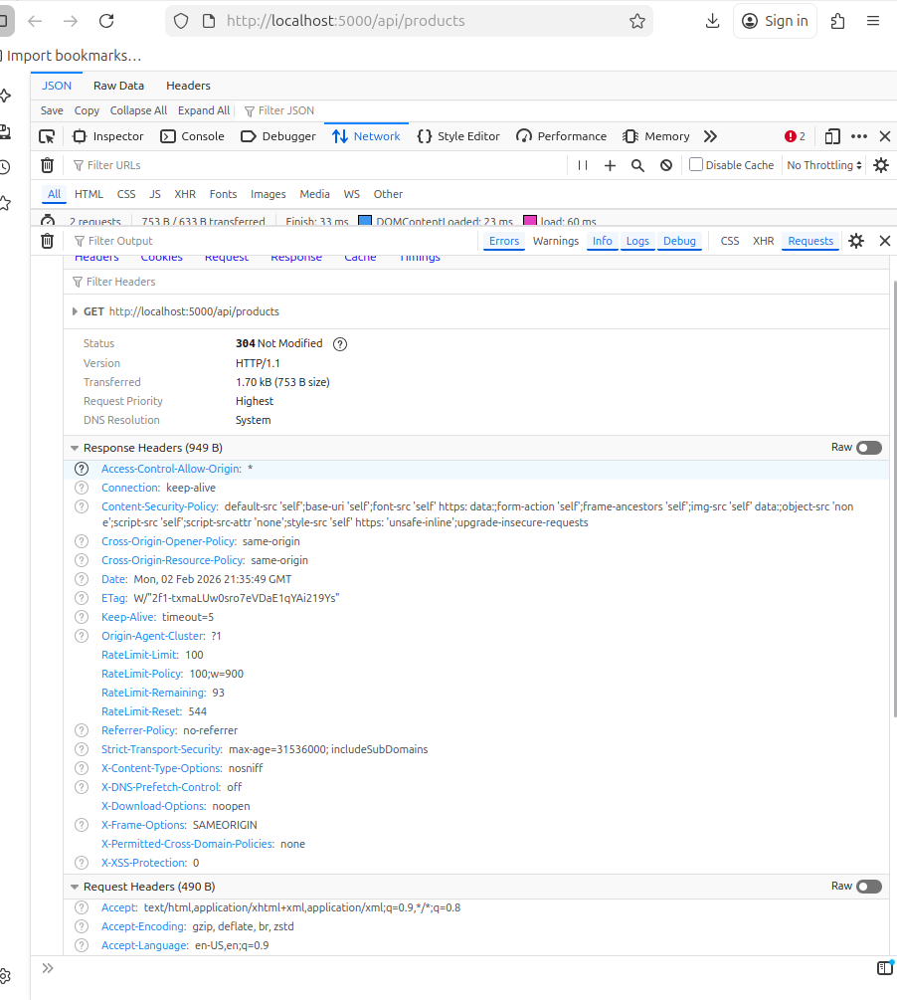
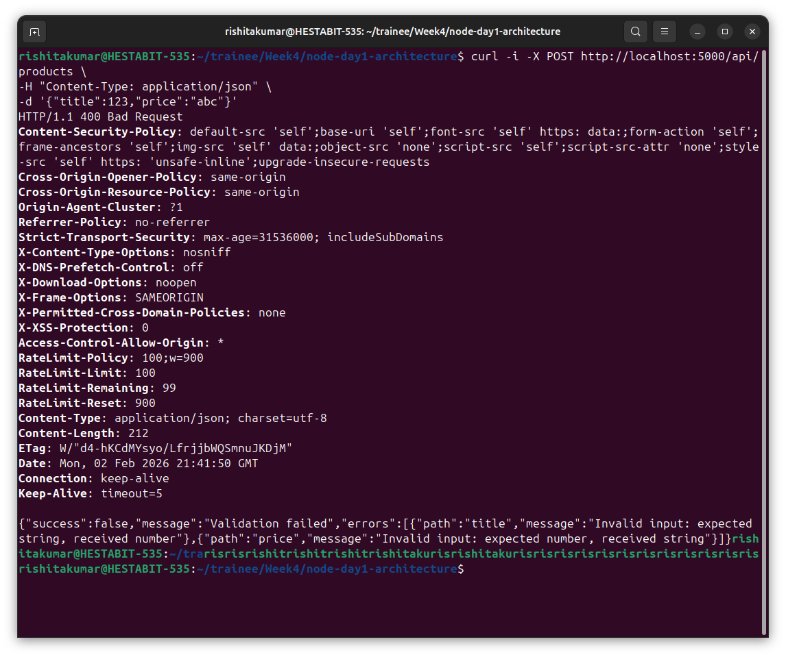
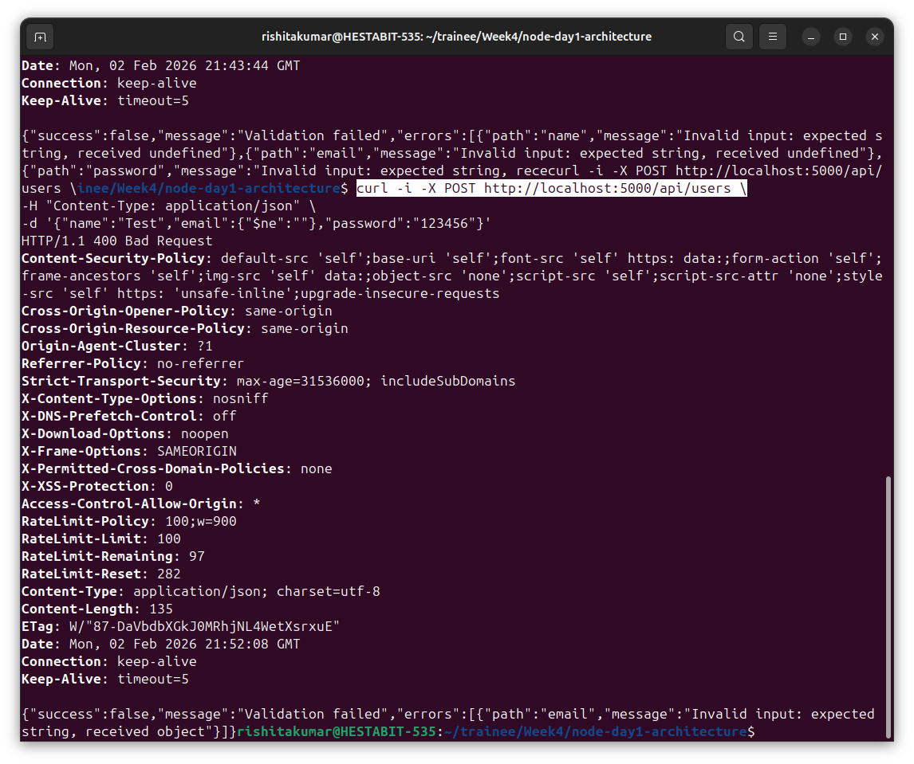

# DAY 1 — Node + Project Architecture

This document explains my Day 1 backend setup as a continuous journey, written in simple language and in my own words. It describes what I created, why I created it, and how everything fits together, from project initialization to running working APIs.

---

I began by creating a new Node.js project and initializing npm using `npm init -y`. After that, I installed the core dependencies required for this architecture: Express for the server, dotenv for environment configuration, mongoose for database connection, and pino with pino-pretty for logging. Once installation was complete, I opened the package.json file and added `"type": "module"` so that I could use ES module syntax with import and export statements. This step was important because the entire project uses modern JavaScript module syntax.


Next, I created the mandatory folder structure as specified in the task. I used a single command to generate all folders inside the src directory, including config, loaders, models, routes, controllers, services, repositories, middlewares, utils, jobs, and logs. I did not skip any folder even if some are empty for now. The purpose of this structure is to follow layered architecture and ensure that each type of responsibility has its own place in the project.


---

After setting up the folders, I created three environment files: .env.local, .env.dev, and .env.prod. Inside each file, I defined values such as PORT and DB_URL. For example, in .env.local I defined port 4000 and a local MongoDB connection string. Then I created a config loader file at src/config/index.js. This file reads NODE_ENV, loads the correct environment file using dotenv, and exports configuration values like port and database URL. Because of this, the same codebase can run in different environments without changing any code.

---

I then set up logging. I created src/utils/logger.js and configured Pino as the logger. This logger is imported wherever logging is needed. Instead of using console.log, the application now uses this centralized logger. This makes logs consistent, structured, and easier to manage.


---

For database handling, I created src/loaders/db.js. This file connects to MongoDB using mongoose and logs whether the connection is successful or fails. Keeping database connection logic inside a loader separates infrastructure concerns from application logic. Before running the project, I started MongoDB using `sudo systemctl start mongod`.


---

The most important part of the architecture is the app loader. I created src/loaders/app.js. This file is responsible for building the Express application in a controlled order. First, it creates the Express app. Then it loads middlewares such as express.json(). After that, it connects to the database using the DB loader. Finally, it mounts all routes. This ensures that the application always starts in a predictable and safe sequence.


---

To verify that the server is working, I created a health endpoint. I added src/controllers/health.controller.js and src/routes/health.routes.js. The endpoint GET /api/health returns a simple JSON response `{ "status": "OK" }`. This endpoint is useful as a basic system check.


---

To practice layered architecture, I added a small Users module with two endpoints. I created src/services/users.service.js, src/controllers/users.controller.js, and src/routes/users.routes.js. The GET /api/users endpoint returns a list of users, and the POST /api/users endpoint creates a user. The flow is Route → Controller → Service. Routes only define URLs, controllers handle request and response, and services contain logic. This separation keeps the code clean and scalable.


---

I created src/server.js as the application entry point. This file imports configuration, calls the app loader, and starts the server using app.listen. The server prints a log when it starts.

---

To run the project, I use the command `npm run local`. When the application starts, I see logs indicating that middlewares are loaded, the database is connected, routes are mounted, and the server has started on port 4000.


---

I tested the APIs using the browser and curl. I opened [http://localhost:4000/api/health](http://localhost:4000/api/health) to test the health endpoint 


and [http://localhost:4000/api/users](http://localhost:4000/api/users) to test the users list. I used a POST request with curl to create a user.


---

The startup flow of the application is as follows. server.js loads configuration, calls the app loader, middlewares are registered, the database connects, routes are mounted, and finally the server starts listening for requests.

---


# QUERY-ENGINE-DOC.md

## Day 3 – High Performance REST API & Advanced Query Engine

On Day 3, I focused only on building a powerful Product API with an advanced query engine. My main objective was to make the API capable of handling real-world product listing scenarios such as searching, filtering, sorting, pagination, soft delete, and structured error handling.

Everything I implemented on this day is related specifically to the Product API and its query.

---

## What I Implemented on Day 3

- I implemented Controller -> Service -> Repository architecture for Product API.
- I created a dynamic query engine for product listing.
- I added search, filtering, sorting, and pagination.
- I implemented soft delete using a timestamp.
- I added centralized and typed error handling.
- I ensured consistent API response format.

---

## Controller - Service - Repository Flow

I structured my Product API into three layers:

### Controller Layer
- I receive HTTP requests.
- I pass request data to the service layer.
- I return formatted responses.
- I forward errors to error middleware.

### Service Layer
- I build dynamic query logic.
- I validate query parameters.
- I apply search, filters, sorting, and pagination.
- I call repository functions.

### Repository Layer
- I interact directly with MongoDB using Mongoose.
- I execute database queries.
- I return raw data back to service.

This separation makes my code easier to maintain and scale.


GET /api/products


- I return a list of products.
- I return pagination metadata.


## Search Implementation

GET /api/products?search=phone


What I did:

- I created case-insensitive regular expression search.
- I used MongoDB `$or` condition.
- I searched across multiple fields.

Fields I search in title, description, brand, category  

If the keyword matches any field, I return that product.

---

## Price Filtering


GET /api/products?minPrice=100&maxPrice=500


What I did:

- If minPrice exists -> price >= minPrice
- If maxPrice exists -> price <= maxPrice
- If both exist → price must be between them

Validation I added:

- minPrice must be >= 0  
- maxPrice must be >= 0  
- minPrice cannot be greater than maxPrice  

---

## Tags Filtering


GET /api/products?tags=apple,samsung


What I did:

- I split tags using comma.
- I used MongoDB `$in` operator.
- If product contains any of the tags, I return it.

---

## Sorting


GET /api/products?sort=price:asc
GET /api/products?sort=price:desc


What I did:

- I accept format: field:direction
- Direction can be asc or desc
- Default sorting is by createdAt descending

---

## Pagination


GET /api/products?page=1&limit=10


What I did:

- Default page = 1
- Default limit = 10
- Maximum limit = 100
- I calculate skip as (page - 1) * limit

---

## Soft Delete


DELETE /api/products/:id


What I did:

- I do not remove product from database.
- I set deletedAt = current timestamp.
- Product stays in database.

---

## Excluding Deleted Products (Default)


GET /api/products


What I did:

- I return only products where deletedAt is null.

---

## Including Deleted Products


GET /api/products?includeDeleted=true


What I did:

- I return both deleted and active products.

---

## Get Product By ID


GET /api/products/:id


What I did:

- I fetch product by id.
- If product is not found, I throw Product Not Found error.

---

## Centralized Error Handling

What I did:

- I created custom error classes.
- I attach error codes to errors.
- I created a global error middleware.
- All errors are returned in a single format.

---

## Global Error Response Format

```json
{
  "success": false,
  "message": "Error message",
  "code": "ERROR_CODE",
  "timestamp": "ISO_TIMESTAMP",
  "path": "/api/products"
}


# SECURITY-REPORT.md  
DAY 4 — Security, Validation, Rate Limiting & Hardening

---

## Introduction

On Day 4 of this project, the objective was to secure and harden the backend API by introducing proper validation, sanitization, and protection against common web vulnerabilities.

The focus areas included:

- Securing HTTP headers  
- Validating incoming requests  
- Preventing malformed and malicious inputs  
- Adding rate limiting  
- Applying payload size limits  
- Testing vulnerabilities manually  

All implementations were verified using terminal commands (curl) and browser testing.

---

## Security Middleware Implemented

The following global security mechanisms were added:

- Helmet for security headers  
- CORS policy  
- Rate limiting using express-rate-limit  
- Payload size limit (10kb)  
- HTTP Parameter Pollution (HPP) protection  
- Zod schema validation for User and Product  

These are configured inside:

src/middlewares/security.js
src/middlewares/validate.js
src/validators/


Security middleware is applied before all routes in:

src/loaders/app.js


---

## New Files Added

src/middlewares/security.js
src/middlewares/validate.js
src/validators/user.schema.js
src/validators/product.schema.js


---

## Baseline Check – Products API Working

Before performing security tests, the Products API was verified.

URL:

http://localhost:5000/api/products


Result:

- Products list returned successfully  
- Confirms server and database are working  

Status: Passed  




---

## Helmet Security Headers

Helmet was used to add important HTTP security headers.

Command:

```bash
curl -I http://localhost:5000/api/products

Observed Headers:

    Content-Security-Policy

    X-Frame-Options: SAMEORIGIN

    X-Content-Type-Options: nosniff

    Strict-Transport-Security

    Referrer-Policy

Status: Passed

Screenshot:



Product Validation (Zod)

Zod schema validation was applied to product creation.

Test: Invalid Product Types

curl -i -X POST http://localhost:5000/api/products \
-H "Content-Type: application/json" \
-d '{"title":123,"price":"abc"}'


Expected:

400 Bad Request

Validation error messages

Actual Result:

Validation failed

Errors returned for title and price

Status: Passed

Screenshot:



User Validation (Zod)

Zod schema validation was applied to user creation.

Test: Empty Body

curl -i -X POST http://localhost:5000/api/users \
-H "Content-Type: application/json" \
-d '{}'


Expected:

400 Bad Request

Errors for missing name, email, password

Actual Result:

Validation failed

Errors returned for all required fields

Status: Passed

Screenshot:


NoSQL Injection Test

Attempted to inject MongoDB operator into email field.

Command:

curl -i -X POST http://localhost:5000/api/users \
-H "Content-Type: application/json" \
-d '{"name":"Test","email":{"$ne":""},"password":"123456"}'


Expected:

Should not allow object in email field

Actual Result:

Validation failed

Email must be string



Status: Passed


Multiple requests were sent to exceed the rate limit.

for i in {1..120}; do curl -s -o /dev/null -w "%{http_code}\n" http://localhost:5000/api/products; done


Expected:

429 Too Many Requests

Actual Result:

After threshold, server returned 429

Status: Passed


Payload Size Limit

Tested sending request body larger than 10kb.

node -e "console.log(JSON.stringify({name:'A',email:'a@a.com',password:'123456',big:'x'.repeat(12000)}))" | \
curl -i -X POST http://localhost:5000/api/users \
-H "Content-Type: application/json" \
--data-binary @-


Expected:

413 Payload Too Large

Actual Result:

Request rejected

Status: Passed
