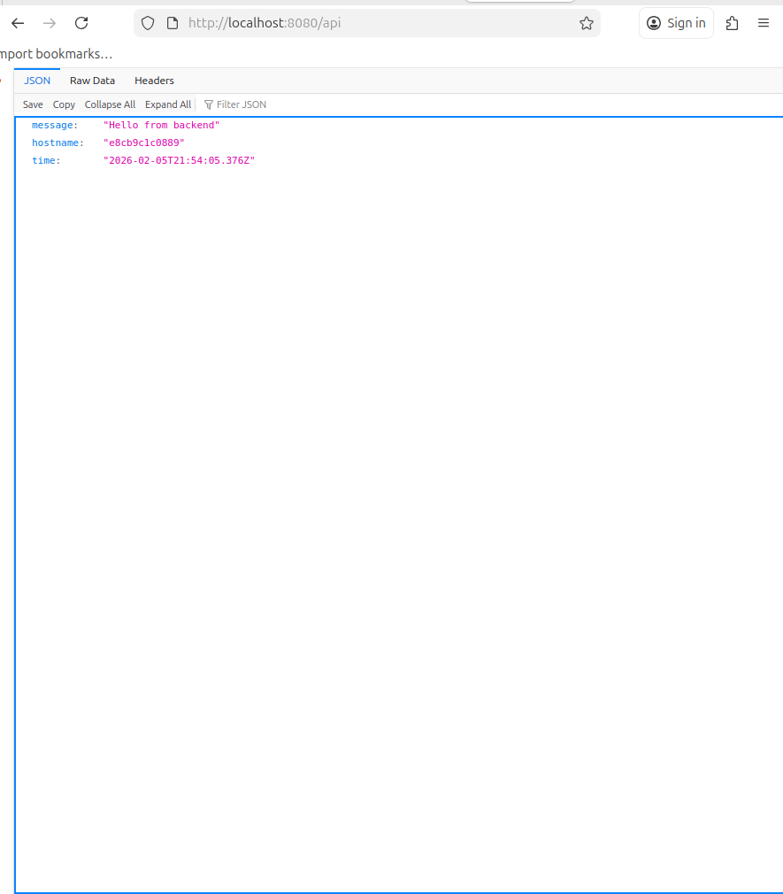
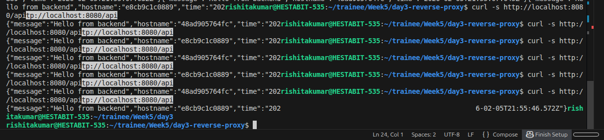
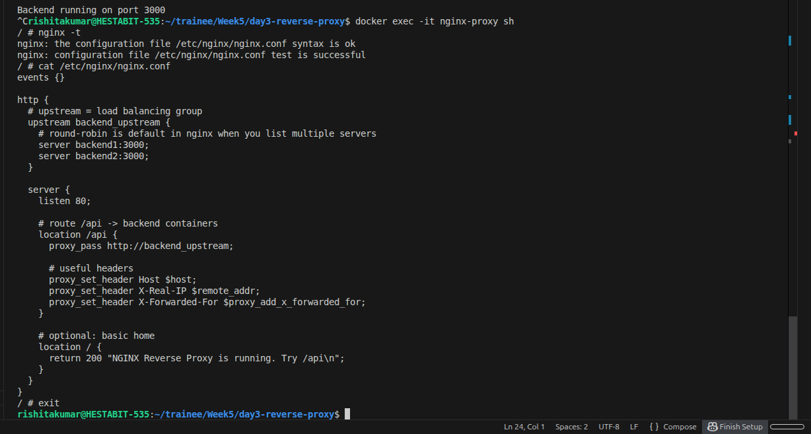

# Day 3 — NGINX Reverse Proxy & Load Balancing (Docker)

## Overview

On Day 3 of my backend infrastructure training, my goal was to understand how real-world systems route traffic and distribute load across multiple backend services. Until this point, I was mainly running a single backend container and directly accessing it. 

Today, I moved one step closer to real production architecture by placing an **NGINX reverse proxy** in front of my backend containers and configuring it to **load balance requests using round-robin**.

This document explains everything I did, step by step, in the same order I worked on it.

---

## Objectives

- Run NGINX inside Docker  
- Run multiple backend containers  
- Route traffic using NGINX  
- Enable round-robin load balancing  
- Verify traffic distribution  

---

## Project Folder Structure

I created a dedicated folder for Day 3 work:

```
day3-reverse-proxy/
 ├─ backend/
 │   ├─ Dockerfile
 │   ├─ package.json
 │   └─ server.js
 ├─ nginx/
 │   └─ nginx.conf
 ├─ docker-compose.yml
 └─ reverse-proxy-readme.md
```

This separation helped keep backend and proxy logic clean and organized.

---

## Step 1 — Creating a Simple Backend Server

I first created a very small Node.js + Express server whose only purpose was to respond with:

- A message
- The container hostname
- Timestamp

This is important because the hostname tells me **which container handled the request**.

### server.js

```js
const express = require("express");
const os = require("os");

const app = express();
const PORT = 3000;

app.get("/api", (req, res) => {
  res.json({
    message: "Hello from backend",
    hostname: os.hostname(),
    time: new Date().toISOString()
  });
});

app.listen(PORT, () => {
  console.log("Backend running on port 3000");
});
```

---

## Step 2 — Dockerizing Backend

I created a Dockerfile inside the backend folder so Docker can build an image.

### backend/Dockerfile

```dockerfile
FROM node:20-alpine
WORKDIR /app
COPY package.json package-lock.json* ./
RUN npm install
COPY . .
EXPOSE 3000
CMD ["npm", "start"]
```

At this stage, the backend is ready to be built into containers.

---

## Step 3 — Creating NGINX Configuration

I created an nginx.conf file to define:

- An upstream block containing two backend servers  
- A server block listening on port 80  
- Routing of /api requests to backend containers  

### nginx/nginx.conf

```nginx
events {}

http {
  upstream backend_upstream {
    server backend1:3000;
    server backend2:3000;
  }

  server {
    listen 80;

    location /api {
      proxy_pass http://backend_upstream;
    }

    location / {
      return 200 "NGINX Reverse Proxy Running";
    }
  }
}
```

NGINX automatically uses **round-robin** when multiple servers are listed.

---

## Step 4 — Docker Compose Setup

I defined three services:

- backend1
- backend2
- nginx

### docker-compose.yml

```yaml
services:
  backend1:
    build: ./backend
    container_name: backend1
    expose:
      - "3000"

  backend2:
    build: ./backend
    container_name: backend2
    expose:
      - "3000"

  nginx:
    image: nginx:alpine
    container_name: nginx-proxy
    ports:
      - "8080:80"
    volumes:
      - ./nginx/nginx.conf:/etc/nginx/nginx.conf:ro
    depends_on:
      - backend1
      - backend2
```

This ensures:

- Both backends run internally  
- NGINX is exposed to host on port 8080  

---

## Step 5 — Building and Starting Containers

I ran:

```bash
docker compose up -d --build
```

This built images and started all containers.

---

## Step 6 — Checking Running Containers

```bash
docker compose ps
```

This confirmed:

- backend1 running  
- backend2 running  
- nginx-proxy running  

---

## Step 7 — Testing in Browser

I opened:

```
http://localhost:8080/api
```

It returned JSON containing hostname.

### First Response



Refreshing multiple times showed different hostnames.

---

## Step 8 — Verifying Round-Robin Using Curl

I executed:

```bash
curl http://localhost:8080/api
curl http://localhost:8080/api
curl http://localhost:8080/api
```

Each response showed alternating hostnames.

### Round Robin Proof



This confirmed NGINX is distributing traffic across both backend containers.

---

## Step 9 — Checking NGINX Container Logs

```bash
docker logs nginx-proxy
```

### Logs Output


The logs show incoming requests being processed by NGINX.

---

## Step 10 — Entering NGINX Container

```bash
docker exec -it nginx-proxy sh
```

Inside container:

```bash
cat /etc/nginx/nginx.conf
```

### NGINX Config Inside Container



This verified my config file was mounted correctly.

---

## What I Learned

- Reverse proxy sits between client and backend  
- NGINX can route based on URL paths  
- Docker Compose allows running multiple replicas easily  
- Round-robin happens automatically in NGINX upstream  
- Container hostname is useful for debugging  
- Infrastructure can be tested locally without cloud  

---

## Final Outcome

- Two backend containers running  
- NGINX proxy running  
- Requests to /api are balanced  
- Architecture behaves like production system  

---

## Conclusion

Day 3 helped me understand how real systems scale horizontally. Instead of relying on a single server, traffic can be distributed across multiple instances using a reverse proxy. This foundation will be essential for learning Kubernetes, microservices, and cloud deployments later.

