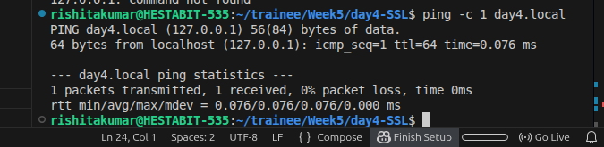
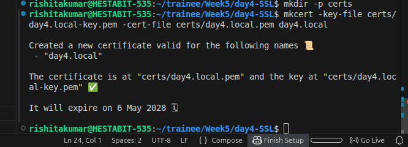
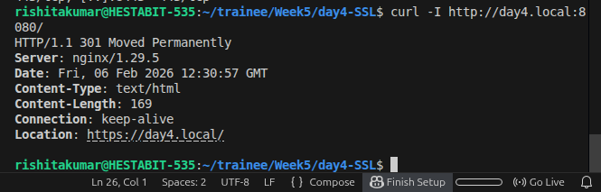

# Day 4 — SSL + Self-Signed Certificates + mkcert + HTTPS (NGINX)

## Overview

On Day 4 of my training, I focused on securing my application using HTTPS.  


The main goal of this day was to:

- Understand SSL/TLS at a basic level  
- Generate local trusted certificates  
- Configure NGINX to terminate HTTPS  
- Redirect all HTTP traffic to HTTPS  
- Confirm secure connection in browser  

This document explains everything I did, step by step, in the same order I performed it.

---

## Step 1 — Choosing a Local Domain

I selected a local development domain:

```
day4.local
```

Using a domain instead of `localhost` because SSL certificates are issued for domains.

---

## Step 2 — Installing mkcert

mkcert is a tool that generates locally trusted certificates.

I installed mkcert and its dependencies, then verified the installation.

---

## Step 3 — Installing mkcert Local CA

Next, I installed mkcert's local Certificate Authority so that certificates generated by mkcert would be trusted by my browser.

After this step, my system was ready to create trusted local certificates.

---

## Step 4 — Mapping Domain to Localhost

I edited the hosts file:

```
/etc/hosts
```

And added:

```
127.0.0.1 day4.local
```

This makes my system resolve `day4.local` to my local machine.

### Ping Test



This confirmed that `day4.local` correctly points to localhost.

---

## Step 5 — Creating Certificates Folder

Inside my Day 4 project directory, I created a folder:

```
certs/
```

This folder stores SSL certificates and private keys.

---

## Step 6 — Generating Self-Signed Certificate

Using mkcert, I generated certificate and key files:

```
day4.local.pem
day4.local-key.pem
```

These files were placed inside the `certs/` folder.

### Certificate Generation



This confirmed successful certificate creation.

---

## Step 7 — Configuring NGINX for HTTPS

I updated the `nginx.conf` file with two server blocks:

### 1) HTTP Server (Redirect)

- Listens on port 80
- Redirects all traffic to HTTPS

### 2) HTTPS Server

- Listens on port 443
- Loads SSL certificate and key
- Proxies `/api` to backend containers

This means SSL termination happens at NGINX.

---

## Step 8 — Updating Docker Compose

I modified `docker-compose.yml` to:

- Expose port 8443 for HTTPS
- Mount certificates folder inside NGINX container

This allows NGINX to access SSL files.

---

## Step 9 — Restarting Containers

I stopped old containers and rebuilt everything:

```
docker compose down
docker compose up -d --build
```

This ensured new SSL settings were applied.

---

## Step 10 — Testing HTTP to HTTPS Redirect

I tested HTTP endpoint:

```
http://day4.local:8080
```

It automatically redirected to:

```
https://day4.local:8443
```

### Redirect Proof



This confirms forced HTTPS.

---

## Step 11 — Testing HTTPS API

I accessed:

```
https://day4.local:8443/api
```

The API returned JSON successfully.

### HTTPS API Working


---

## Step 12 — Confirming Lock Icon in Browser

When opening:

```
https://day4.local:8443
```

I saw the lock icon in the browser, which confirms:

- Certificate is trusted
- Connection is encrypted

This is the final confirmation that HTTPS is working correctly.

---

## What I Learned

- SSL encrypts data between client and server  
- HTTPS is mandatory for production systems  
- NGINX can terminate SSL and forward traffic internally  
- mkcert is very useful for local development  
- Certificates must be mounted into containers  
- HTTP should always redirect to HTTPS  

---


