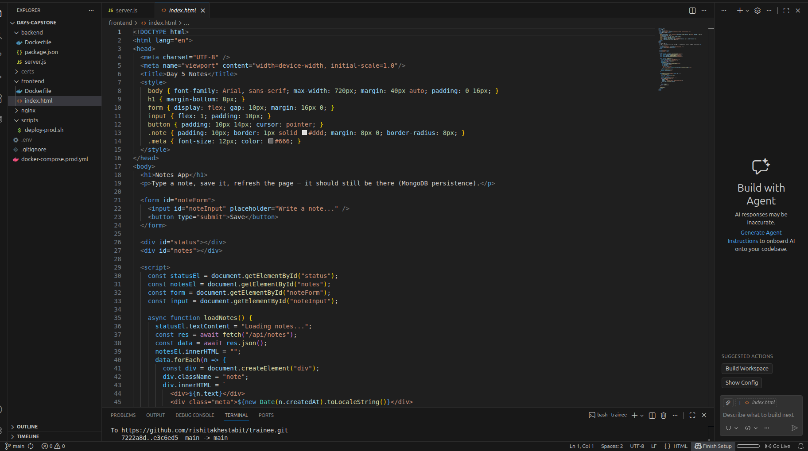
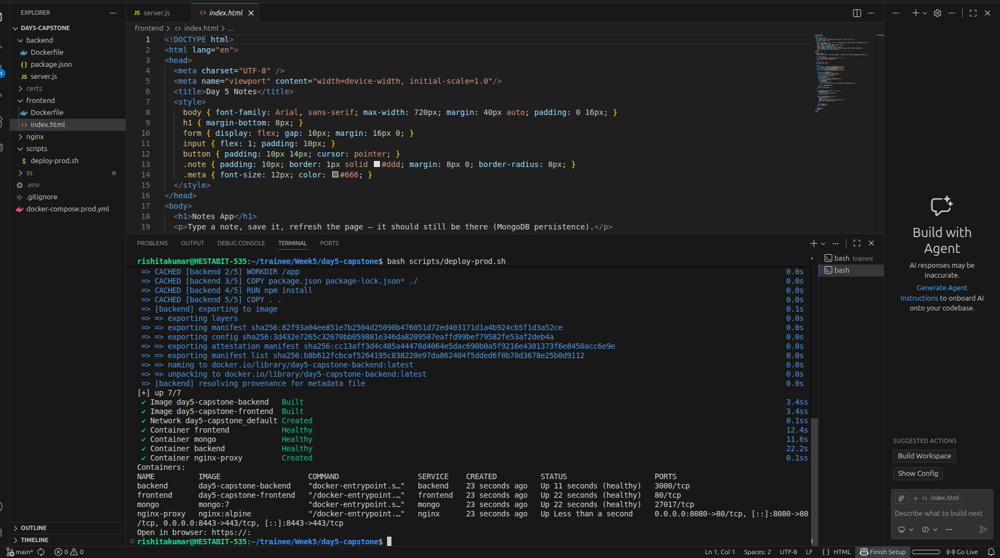

# Day 5 Capstone — Production Deployment Guide

## Overview

This document describes my **Day 5 capstone project**, where I deployed a full‑stack Notes application using **Docker and Docker Compose** in a production‑style setup.  
The goal of this exercise was not just to make the app work, but to understand **how real production servers behave**, how services talk to each other, and how deployments are automated.

The stack includes:
- Frontend (static HTML/JS)
- Backend (Node.js + Express)
- Database (MongoDB)
- Reverse Proxy (Nginx with HTTPS)
- Docker volumes for persistence
- Health checks, restart policies, and log rotation

---

## Project Structure

I started by organizing the project in a clean, production‑friendly structure.  
Each service lives in its own folder so responsibilities are clearly separated.



---

## Step 1 — Containerizing the Services

### Backend (Node.js + Express)

I containerized the backend using a Dockerfile that:
- Uses a lightweight Node base image
- Installs only production dependencies
- Starts the Express server

This ensured consistent behavior across environments.

### Frontend (Static App)

The frontend is a static application served through Nginx, which reflects how production frontends are typically deployed.

### Database (MongoDB)

MongoDB runs in its own container, isolated from application logic.  
A Docker volume is attached to ensure data persistence.

---

## Step 2 — Docker Compose (Production Setup)

The entire stack is defined in `docker-compose.prod.yml` and started using:

```bash
docker compose -f docker-compose.prod.yml up -d
```

This single command builds and launches the complete application.

---

## Step 3 — Container Networking

Docker Compose provides an internal network that allows services to communicate using service names instead of IP addresses.

---

## Step 4 — Reverse Proxy and HTTPS

Nginx is used as a reverse proxy to:
- Serve the frontend
- Forward API requests to the backend
- Terminate HTTPS connections

---

## Step 5 — Deployment Automation

A deployment script (`deploy-prod.sh`) automates the build and startup process.



---

## Step 6 — Health Checks

Each service exposes a health endpoint so Docker can monitor container health and control startup order.

---

## Step 7 — Log Rotation

Log rotation is configured using Docker’s logging driver to prevent logs from consuming unlimited disk space.

---

## Step 8 — Running Containers

All containers run successfully after deployment.


---

## Step 9 — Application in Action

The Notes application is accessible over HTTPS and demonstrates MongoDB persistence.


---


