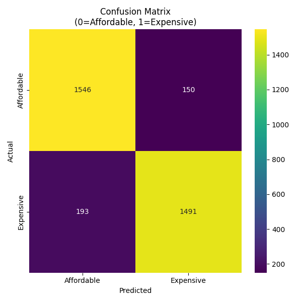
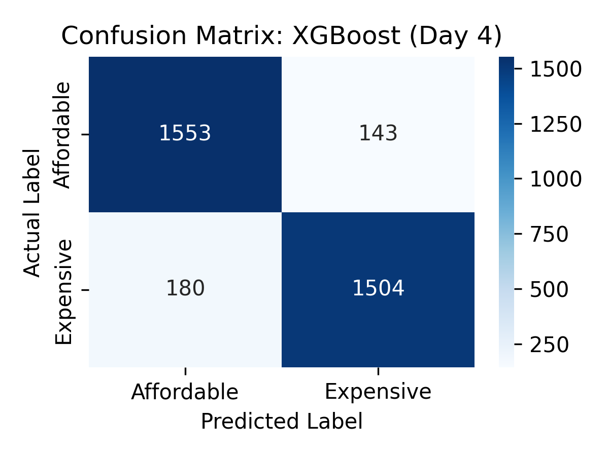
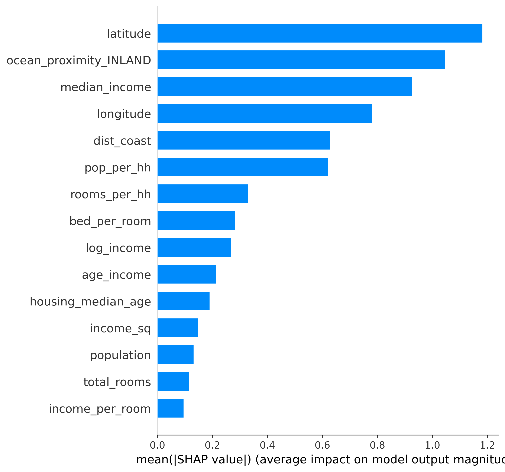
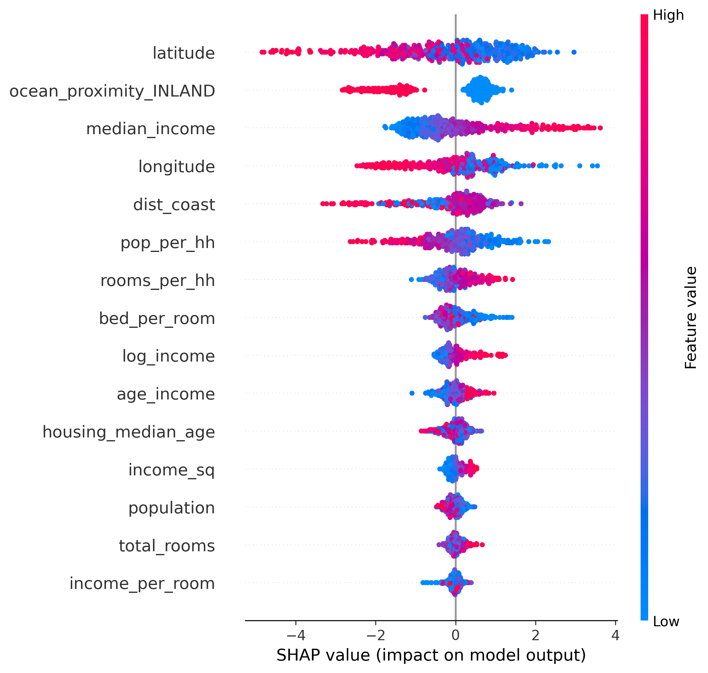

# Day 4 – Model Interpretation 

## 1. What I Started With (Day 3 Baseline)

- Task: Binary classification – predict if a house is Affordable (0) or Expensive (1).
- Target: Price > median ($169,200) → 1 (Expensive), else 0 (Affordable).
- Data: 13,516 training rows, 22 features, almost perfectly balanced classes.
- Best Day 3 model: XGBoost saved as src/models/best_model.pkl.
- Day 3 performance: CV ROC-AUC ≈ 0.964, Test ROC-AUC ≈ 0.964.

This gave a strong baseline, but with only basic hyperparameters.

---

## 2. Day 4 Goal

- Improve the best model (XGBoost) with hyperparameter tuning.
- Add model interpretation and explainability (SHAP + feature importance).
- Produce clean artifacts and a clear story of what the model learned.

---

## 3. Hyperparameter Tuning (tuning.py)

I used Optuna to tune an XGBoost classifier:

- Search space:
  - n_estimators: 50–300
  - max_depth: 3–8
  - learning_rate: 0.01–0.3
  - subsample: 0.7–1.0
  - colsample_bytree: 0.7–1.0
- Fixed: random_state=2025, eval_metric="logloss".
- CV: 5-fold StratifiedKFold on the same binary target as Day 3.
- Objective: maximize mean ROC-AUC across folds.

Outputs:
- tuning/results.json – best parameters + best CV ROC-AUC.
- models/tuned_xgboost.pkl – tuned model trained on full training data.

Hyperparameter tuning gave a small but consistent improvement over the baseline ROC-AUC.

---

## 4. SHAP Analysis and Feature Importance (shap_analysis.py)

I ran SHAP analysis (TreeExplainer) on the XGBoost model using a 500-row sample of X_train:

Generated:
- shap_summary.png – SHAP beeswarm summary plot.
- feature_importance.png – bar chart of mean |SHAP| per feature.
- top_features.csv – table of the top 10 features by SHAP importance.

---

## 5. MODEL INTERPRETATION – What the Model Actually Learned

### 5.1 Top 10 Features (from top_features.csv)

1) latitude – 1.182  
2) ocean_proximity_INLAND – 1.046  
3) median_income – 0.925  
4) longitude – 0.779  
5) dist_coast – 0.627  
6) pop_per_hh – 0.620  
7) rooms_per_hh – 0.329  
8) bed_per_room – 0.282  
9) log_income – 0.268  
10) age_income – 0.212  

### 5.2 Interpretation of These Features

- Location is the main driver:
  - latitude, longitude, dist_coast, and the INLAND indicator dominate.
  - This matches real-world real estate: where the house is matters more than any single numeric factor.
- Income still matters a lot:
  - median_income and log_income are in the top 10 and strongly influence the model.
  - Higher income neighborhoods are much more likely to be classified as “Expensive”.
- Engineered features work:
  - dist_coast: closer to the coast → higher chance of being “Expensive”.
  - pop_per_hh, rooms_per_hh, bed_per_room, age_income add useful signals beyond raw columns.

In short, the model has learned a very sensible rule:
- Expensive houses = certain locations (lat/lon), near coast, often inland vs coastal patterns, combined with high incomes and denser, larger homes.

---

## 6. How Day 4 Improved the Model and Understanding

Technical improvement:
- Went from a fixed XGBoost configuration to a tuned version with slightly better ROC-AUC.
- Confirmed the model generalizes well via cross-validation.

Interpretation improvement:
- Instead of only saying “XGBoost works”, I can now explain:
  - Which features matter most.
  - How those features push predictions towards “Affordable” or “Expensive”.
  - How location and income interact in the model.

SHAP vs simple feature importance:
- Day 2/3 tree-based importance: shows how often a feature is used for splits.
- Day 4 SHAP: shows how much each feature actually changes the predicted probability for real examples.
- SHAP therefore gives a more faithful picture of the model’s reasoning.

---

## 7. Final Artifacts I Produced

- src/training/tuning.py – Optuna tuning script for XGBoost.
- tuning/results.json – best parameters and best CV ROC-AUC.
- models/tuned_xgboost.pkl – tuned XGBoost model.
- src/evaluation/shap_analysis.py – SHAP + feature importance script.
- src/evaluation/shap_summary.png – SHAP summary plot.
- src/evaluation/feature_importance.png – SHAP bar plot.
- src/evaluation/top_features.csv – numeric ranking of features.

---

## 8. My Personal Takeaways

- Tuning can still help even when the baseline is very strong.
- SHAP is much more informative than just printing feature_importances_.
- For housing, the model confirmed a simple story:
  “Location (lat/lon/coast) + income + engineered features” explain most of the price classification.
- Now I can not only build a good model, but also **interpret** and **justify** its decisions, which is the main goal of Day 4.
