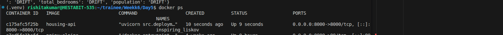
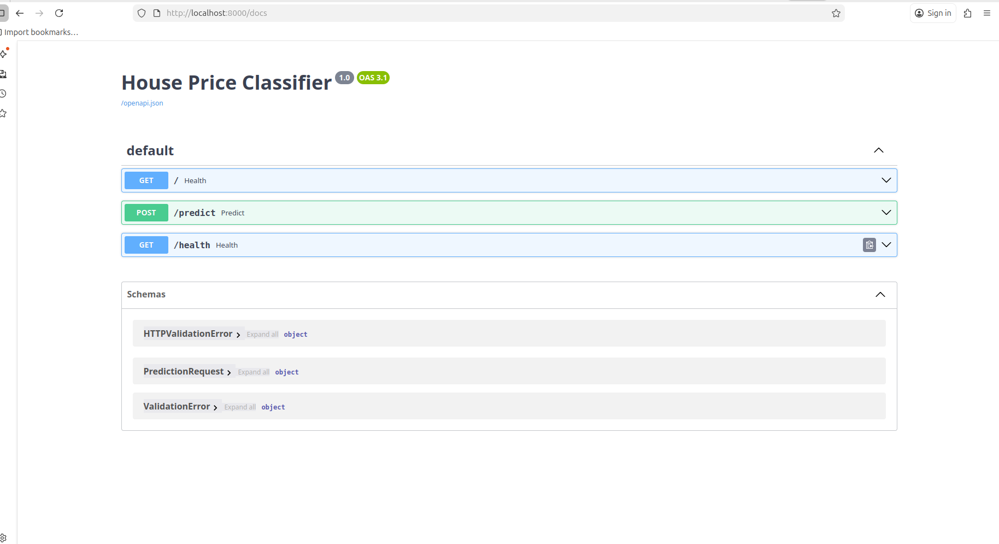
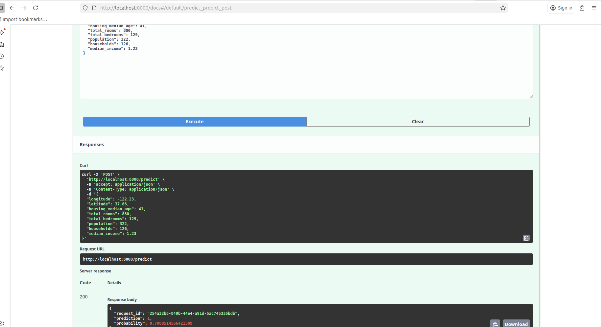

# Day 5 --- Model Deployment & Monitoring

This stage deploys the trained ML model as an API, logs predictions,
detects drift, and packages the system using Docker.

## 1. FastAPI Model Deployment

The trained model (`best_model.pkl`) is served using **FastAPI**.

### Features

-   Model loading using `joblib`
-   Input validation using **Pydantic**
-   Feature transformation before inference
-   Prediction probability output
-   Unique `request_id` for tracking
-   Prediction logging for monitoring

### API Endpoints

  Endpoint     Method   Description

  `/`          GET      API status
  `/health`    GET      Health check
  `/predict`   POST     Generate prediction

## 2. Prediction Pipeline

Input Request → Feature Transformation → Model Prediction → Logging

Feature engineering inside the API:

    rooms_per_hh = total_rooms / households
    bed_per_room = total_bedrooms / total_rooms
    pop_per_hh = population / households
    log_income = log1p(median_income)

Features are aligned using:

    feature_list.json

## 3. Prediction Logging

Every API request is logged in:

    prediction_logs.csv

Logged fields include:

-   timestamp
-   request_id
-   input features
-   prediction
-   probability

This enables monitoring and debugging of production predictions.

## 4. Data Drift Monitoring

A drift detection script compares **training data distribution** vs
**live prediction data**.

### Script

    src/monitoring/drift_checker.py

### Method

Uses **Kolmogorov--Smirnov test (KS test)**:

    ks_2samp(reference_data, live_data)

Decision rule:

    p-value < 0.05 → DRIFT
    p-value >= 0.05 → OK

Reference dataset:

    data/processed/X_train.csv

Live dataset:

    prediction_logs.csv

## 5. Docker Containerization

The API is containerized for deployment.

### Dockerfile

    FROM python:3.12-slim

    WORKDIR /app

    COPY requirements.txt .
    RUN pip install --no-cache-dir -r requirements.txt

    COPY . .

    CMD ["uvicorn", "src.deployment.api:app", "--host", "0.0.0.0", "--port", "8000"]

## 6. Build Docker Image

Run inside the **Day5 root folder**:

    docker build -t housing-api .

## 7. Run Container

    docker run -p 8000:8000 housing-api

The API becomes available at:

    http://localhost:8000/docs

## 8. Swagger API Testing

Swagger UI allows interactive testing of the API.

Example request:

    {
      "longitude": -122.23,
      "latitude": 37.88,
      "housing_median_age": 41,
      "total_rooms": 880,
      "total_bedrooms": 129,
      "population": 322,
      "households": 126,
      "median_income": 1.23
    }

Example response:

    {
      "request_id": "uuid",
      "prediction": 1,
      "probability": 0.78
    }

## 9. Screenshots

### Docker Build

### Swagger Interface

### Prediction Endpoint

