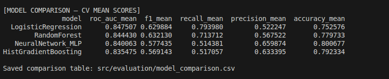

# MODEL COMPARISON — DAY 3  
(Model Building & Evaluation)

---

## What I did in Day 3

In Day 3, my main focus was to **build, evaluate, and compare multiple machine learning models** on the churn dataset created in Day 2.

Instead of directly choosing one model, I created a **single training pipeline** where:
- All models are trained on the same data
- All models are evaluated using the same metrics
- The best model is selected automatically based on performance

This helped me understand **which model actually performs best for churn prediction**, not just which one looks good on accuracy.

---

## Models I trained

I trained the following four models:

1. Logistic Regression  
2. Random Forest  
3. Histogram-based Gradient Boosting  
4. Neural Network (MLP)

All models used the **same engineered features and encoded dataset** from Day 2, so the comparison is fair.

---

## How I evaluated the models

### Cross-validation

I used **5-fold stratified cross-validation** for model evaluation.

- Stratification ensures that each fold has the same churn vs non-churn ratio.
- This is important because churn prediction is an **imbalanced classification problem**.

### Metrics used

For each model, I calculated:

- Accuracy  
- Precision  
- Recall  
- F1 Score  
- ROC-AUC  

I selected **ROC-AUC as the primary metric** because:
- It works well with imbalanced data
- It evaluates how well the model ranks churners vs non-churners
- It does not depend on a fixed probability threshold

---

## Cross-validation results (mean scores)

The table below shows the **average cross-validation scores** for each model:

| Model | ROC-AUC | F1 | Recall | Precision | Accuracy |
|------|--------|----|--------|-----------|----------|
| Logistic Regression | **0.8475** | 0.6299 | **0.7940** | 0.5222 | 0.7526 |
| Random Forest | 0.8444 | **0.6321** | 0.7137 | 0.5675 | 0.7797 |
| Neural Network (MLP) | 0.8401 | 0.5774 | 0.5144 | 0.6599 | **0.8007** |
| HistGradientBoosting | 0.8355 | 0.5691 | 0.5171 | 0.6334 | 0.7923 |

### Visual comparison

Below is a visual summary of the cross-validation mean scores that I used during comparison:

---

## Model-wise observations

### Logistic Regression
- It achieved the **highest ROC-AUC**, which was my main selection metric.
- It also achieved the **highest recall**, meaning it correctly identified most churn customers.
- The performance was stable across cross-validation and testing.
- Even though it is a simple model, it generalized very well.

### Random Forest
- Performed very close to Logistic Regression.
- Slightly higher F1 score and accuracy.
- However, recall was lower than Logistic Regression.
- This means it missed more churners, which is not ideal for this problem.

### Neural Network (MLP)
- Achieved the **highest accuracy**, but this is misleading.
- Recall was very low (~51%), meaning many churn customers were missed.
- High accuracy here mainly comes from predicting the majority class (non-churn).

### Histogram-based Gradient Boosting
- Had the lowest ROC-AUC among all models.
- Did not outperform other models in any important metric.
- Hence, it was not selected.

---

## Final model selection

I selected **Logistic Regression** as the final model because:

- It achieved the **best ROC-AUC** during cross-validation.
- It detected the **maximum number of churn customers** (highest recall).
- Its performance on the holdout test set was very close to cross-validation results.
- This indicates good generalization and no overfitting.

---

## Holdout test performance

After selecting Logistic Regression, I retrained it on the full training data and evaluated it on a separate test set.

The final test results were:

- Accuracy: 0.739  
- Precision: 0.505  
- Recall: 0.786  
- F1 Score: 0.615  
- ROC-AUC: 0.845  

These results confirmed that the model performs consistently on unseen data.

---

## Artifacts generated

During Day 3, the following files were generated:

- `src/training/train.py` – Unified training pipeline  
- `src/models/best_model.pkl` – Saved best model  
- `src/evaluation/metrics.json` – Cross-validation and test metrics  
- `src/evaluation/model_comparison.csv` – Model comparison table  
- `src/evaluation/confusion_matrix.png` – Confusion matrix of best model  

---

## Conclusion

In Day 3, I successfully built a **reliable and reproducible model training pipeline**.  
By comparing multiple models using proper evaluation metrics, I was able to select the most suitable model for churn prediction.

Logistic Regression turned out to be the best choice because it balances performance, stability, and interpretability, making it a strong baseline for further optimization and explainability in the next phase.

---
