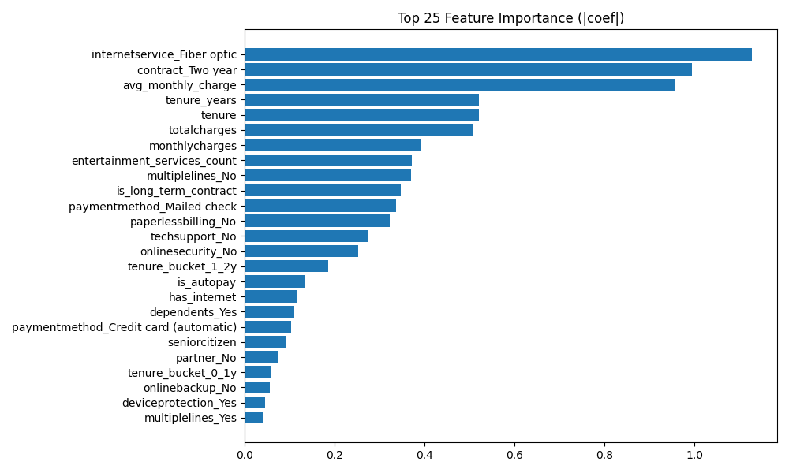
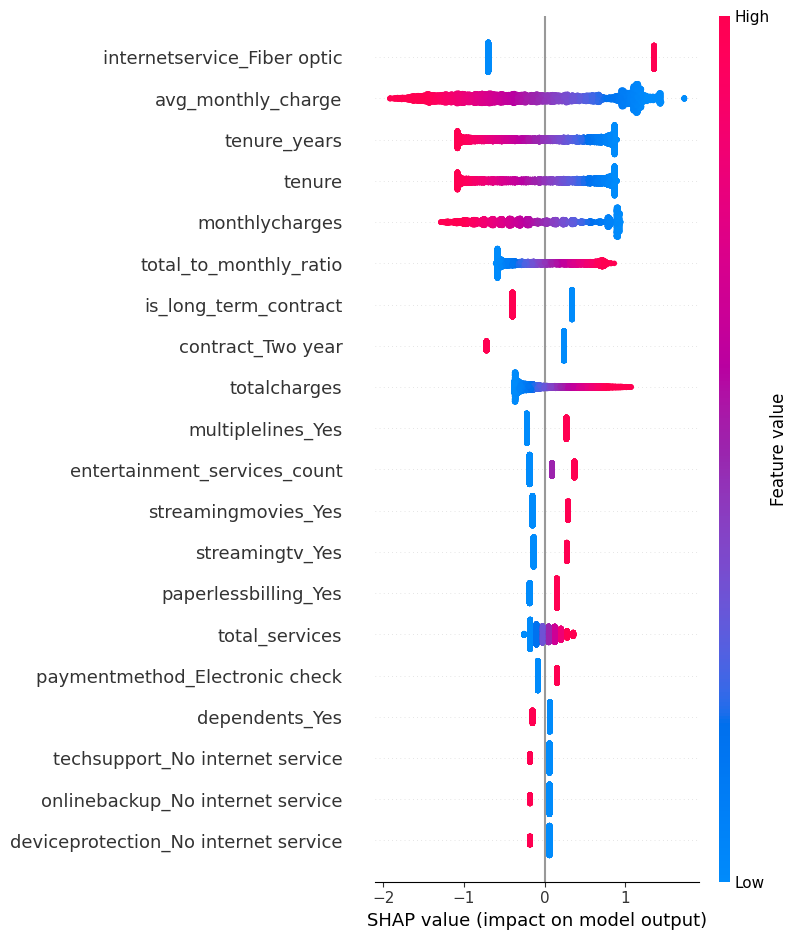
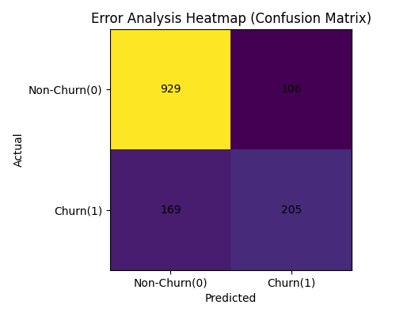

# DAY 4 — HYPERPARAMETER TUNING + EXPLAINABILITY + ERROR ANALYSIS

---

## What I Did Today

After building and selecting the best model in Day 3 (Logistic Regression), today I moved from **model selection -> model understanding**.

So Day 4 :

1. Improving the model 
2. Understanding the model
3. Understanding mistakes 
---

## 1. Hyperparameter Tuning

I tuned the Logistic Regression model using GridSearchCV.

The goal was not to find the best configuration of the same model.

### Best Parameters Found
- C = 1.0
- penalty = L1
- class_weight = None

### Performance Comparison

Model | ROC-AUC 
Baseline : 0.84448 
Tuned : 0.84510 

The improvement is small but important — this means the model was already strong and tuning helped slightly refine decision boundaries.

The tuned model was saved:

```
src/models/best_model_tuned.pkl
```

---

## 2. Feature Importance

To understand what affects churn most, I generated feature importance.



### Interpretation

The model mostly looks at:
- Monthly charges
- Contract type
- Internet service
- Tenure
- Payment method

Meaning: **customers paying more and staying shorter are likely to churn**.

---

## 3. SHAP Explainability

SHAP explains individual predictions.

 “The model predicts churn = 1”

For example:
 “The model predicts churn because monthly charges are high and tenure is low.”



### What SHAP tells us

Red = pushes towards churn  
Blue = pushes towards non‑churn

So we can visually understand decision logic.

This makes the model interpretable — extremely important in real companies.

---

## 4. Error Analysis

Even a good model makes mistakes.

So I analyzed errors using a confusion heatmap.



This shows:

False Positives → Model predicted churn but user stayed  
False Negatives → Model missed a churner

False negatives are more dangerous in business — we lose customers without warning.

I also saved the actual mistake rows:

```
src/evaluation/errors.csv
```

## Artifacts Generated

- src/models/best_model_tuned.pkl
- src/tuning/results.json
- src/evaluation/feature_importance.png
- src/evaluation/shap_summary.png
- src/evaluation/error_analysis_heatmap.png
- src/evaluation/errors.csv

---

## Final Conclusion

The tuned Logistic Regression model remains the best choice.

It is:
- Accurate
- Stable
- Interpretable
- Explainable

