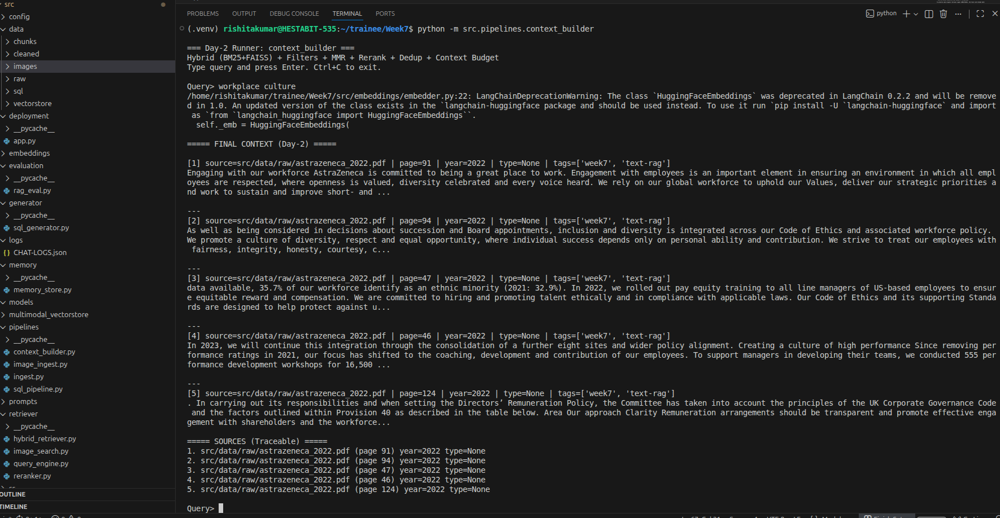
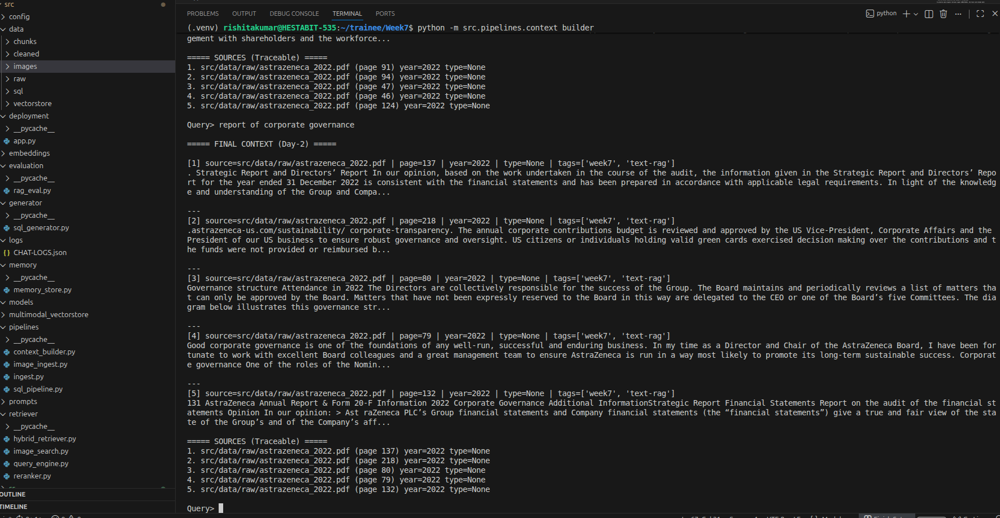
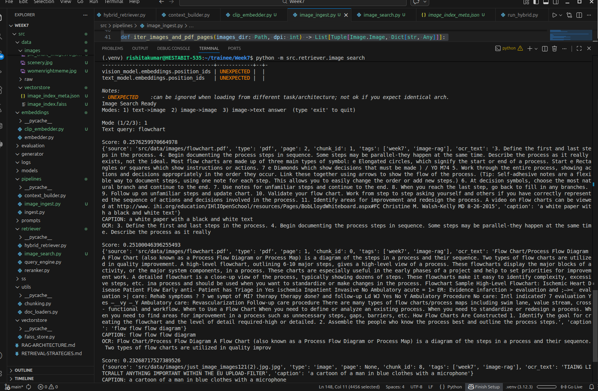
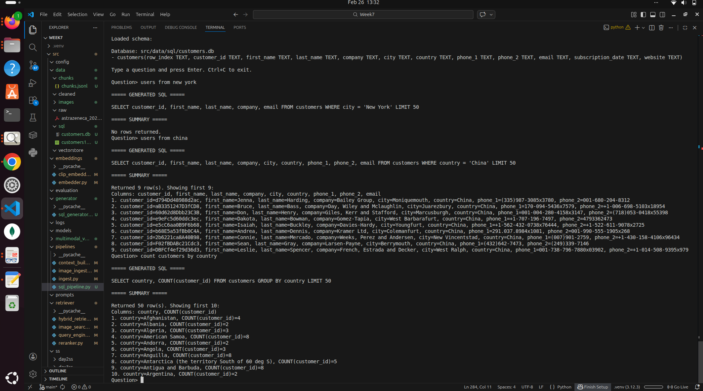
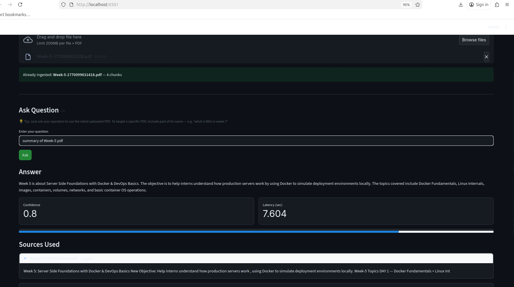
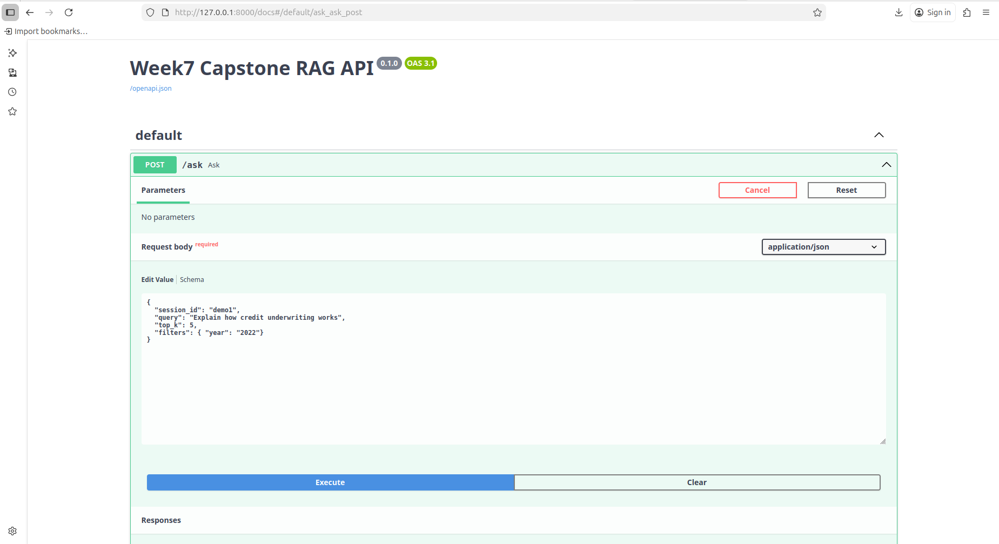
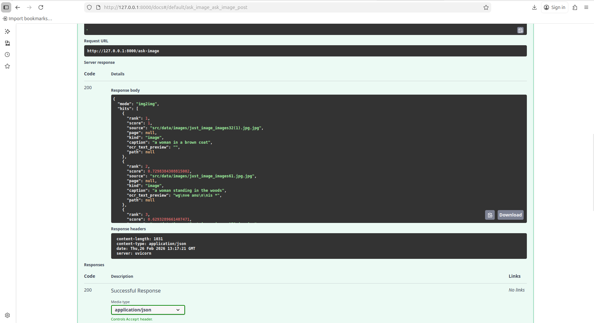
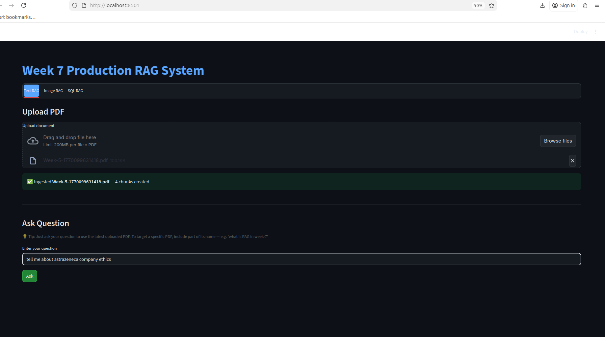
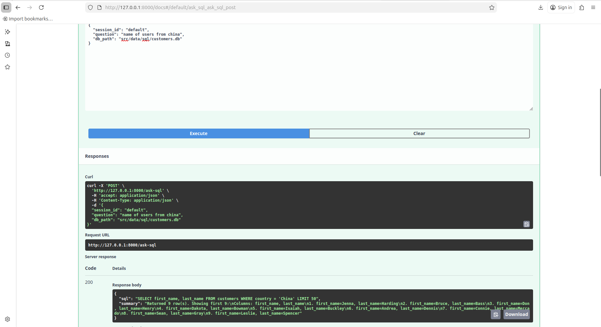
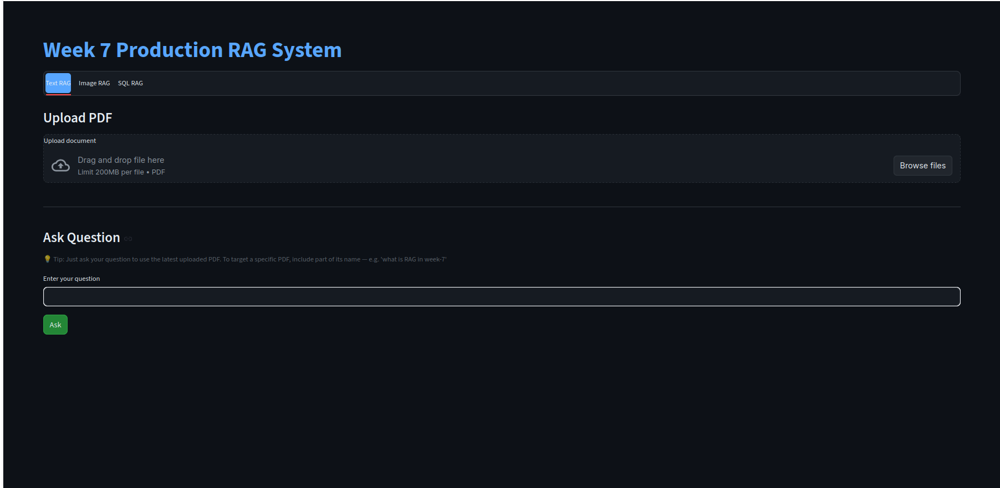

# Week 7 — Production RAG System (End-to-End)

This project demonstrates a complete **Production-Ready Retrieval Augmented Generation (RAG) system** built over 5 days, covering text, multimodal, SQL QA, and deployment.

---

# Project Overview

The system evolves step-by-step:

- Day 1 — Data Ingestion + Chunking + Embeddings + FAISS
- Day 2 — Hybrid Retrieval + Context Engineering
- Day 3 — Multimodal RAG (Image + OCR + CLIP)
- Day 4 — SQL Question Answering (Text → SQL → Answer)
- Day 5 — Full Deployment (FastAPI + Streamlit)

---

# Day 1 — Data Pipeline (RAG Foundation)

fileciteturn5file2

### What was built:
- Document loading (PDF, TXT, CSV, DOCX)
- Cleaning + normalization
- Token-based chunking (500–800 tokens)
- Metadata enrichment (source, page, tags)
- Embedding generation (MiniLM)
- FAISS vector store

### Output:
- `src/data/chunks/chunks.jsonl`
- `src/vectorstore/index.faiss`

---

# Day 2 — Advanced Retrieval

fileciteturn5file3

### Features:
- Hybrid Retrieval (BM25 + Vector)
- MMR (diversity)
- CrossEncoder Reranking
- Deduplication
- Context Packing (token budget)
- Source tracing

### Screenshots

---

# Day 3 — Multimodal RAG

fileciteturn5file1

### Features:
- CLIP embeddings (image + text)
- OCR (Tesseract)
- Captioning (BLIP)
- FAISS image vector store
- Retrieval modes:
  - Text → Image
  - Image → Image
  - Image → Text

### Pipeline:
Image → OCR + Caption → Embedding → FAISS → Retrieval

---

# Day 4 — SQL Question Answering

fileciteturn5file4

### Features:
- Text → SQL generation (LLM)
- Schema-aware prompting
- SQL validation (safe queries only)
- SQLite execution
- Result summarization

### Screenshot

---

# Day 5 — Deployment

fileciteturn5file0

### Features:
- FastAPI backend
- Streamlit UI
- Real-time inference
- Dynamic ingestion
- Multimodal + SQL endpoints

### API Endpoints:
- `/ask` → Text RAG
- `/ask-image` → Image RAG
- `/ask-sql` → SQL QA
- `/ingest` → Dynamic ingestion

### Screenshots

---

# System Architecture

User → Streamlit → FastAPI → Pipelines → Retriever → Context Builder → LLM → Response

---

# Key Highlights

- Hybrid retrieval improves accuracy
- Reranking reduces hallucination
- CLIP enables multimodal search
- SQL QA supports structured queries
- Modular architecture
- Production-ready deployment

---

# Conclusion

This project demonstrates a complete **end-to-end RAG system**, evolving from basic document retrieval to a production-ready multimodal AI system with deployment capabilities.

It is scalable, modular, and suitable for real-world enterprise applications.
