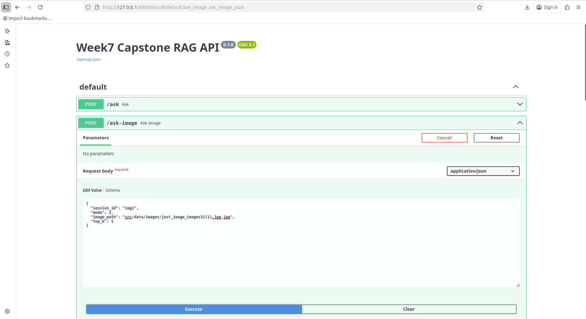

# DEPLOYMENT-NOTES.md

## Week 7 — Production RAG System Deployment

This document describes the deployment and execution of the complete Production RAG system including Text RAG, Image RAG, and SQL QA.

---

# System Overview

The system integrates:

- Text RAG (Hybrid Retrieval + Reranking)
- Image RAG (CLIP + FAISS)
- SQL QA (Text-to-SQL pipeline)
- Memory and Evaluation layer
- FastAPI backend
- Streamlit frontend

Core API implemented in:
- src/deployment/app.py

---

# Architecture Flow

User → Streamlit UI → FastAPI → Pipelines → Retriever → Context Builder → LLM → Response

---

# Features Implemented

## 1. Text RAG
- Hybrid retrieval (BM25 + Vector)
- Reranking using CrossEncoder
- Context building with metadata
- LLM-based answer generation

## 2. Image RAG
- CLIP embeddings for text and image
- FAISS similarity search
- OCR + Caption-based context
- Supports:
  - text → image
  - image → image

## 3. SQL QA
- Text → SQL generation
- SQL validation
- Execution on SQLite DB
- Result summarization

---

# API Endpoints

## POST /ask
Handles text-based RAG queries.

## POST /ask-image
Handles image-based queries:
- text2img
- img2img

## POST /ask-sql
Handles SQL question answering.

## POST /ingest
Uploads and processes new documents dynamically.

---

# Running the System

## Step 1 — Start Backend

uvicorn src.deployment.app:app --host 127.0.0.1 --port 8000 --reload

---

## Step 2 — Run Streamlit UI

streamlit run src/streamlit_app.py

---

## Step 3 — Access

API Docs:
http://127.0.0.1:8000/docs

UI:
http://localhost:8501

---

# Environment Variables

Create .env file:

GROQ_API_KEY=your_key  
GROQ_MODEL=llama-3.3-70b-versatile  

---

# Screenshots

## PDF Ingestion

## PDF Question Answering

## Image Ingest

## Image to Query

## Streamlit Upload

## Streamlit Query

## Retrieval Output

## SQL Query

## Streamlit UI

---

# Key Highlights

- Dynamic ingestion with retriever reload
- Hybrid retrieval improves accuracy
- Reranker reduces hallucination
- CLIP enables multimodal search
- SQL pipeline supports structured queries
- Evaluation system provides confidence scoring

---

# Conclusion

The system demonstrates a complete production-ready RAG pipeline with multimodal capabilities and real-time deployment. It is modular, scalable, and supports extension into enterprise-level applications.
