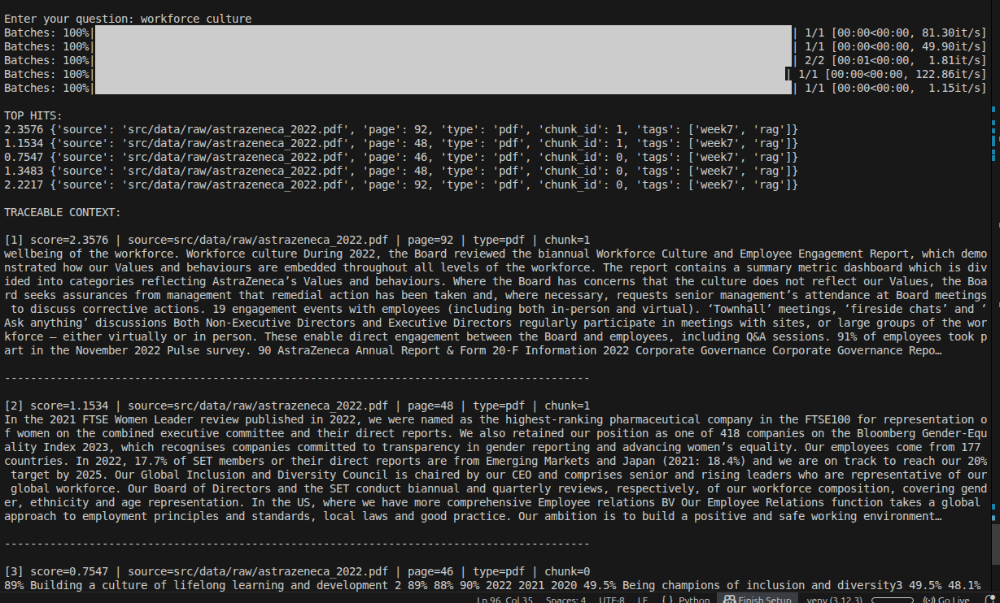
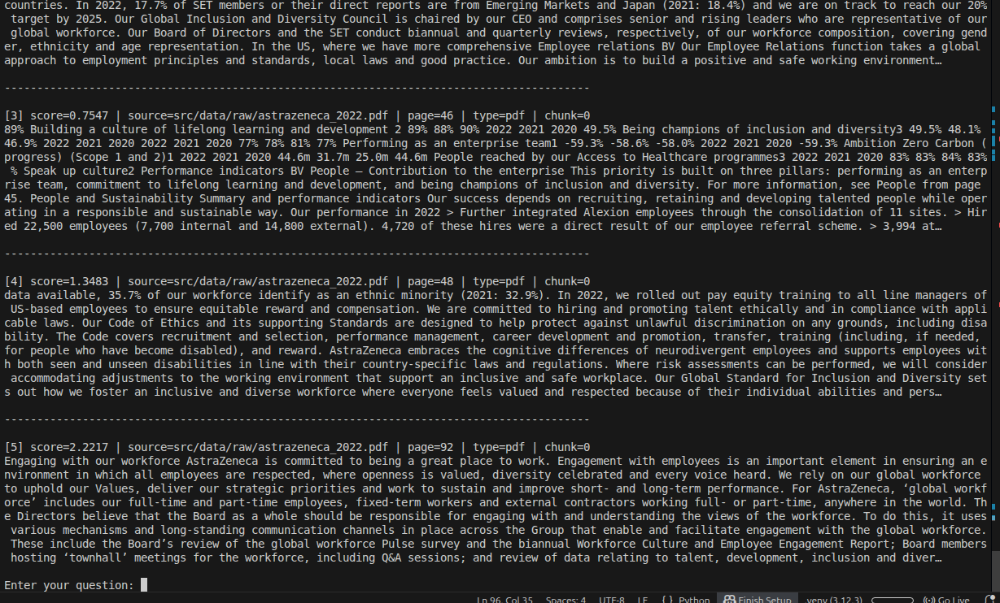

# RETRIEVAL-STRATEGIES.md (Day 2) — Advanced Retrieval & Context Engineering (Updated)

This document explains the **Day-2 retrieval strategy** as implemented in this repo after the latest changes:
- Query is **dynamic** (user asks any question)
- Retrieval configuration is **fixed in code** (e.g., `TOP_K=5`, `FILTERS={"type":"pdf"}`)
- Context builder is the **main runnable entrypoint** (`python -m src.pipelines.context_builder`)

---

## 1) Objective (Day 2 Goal)

Day 2 improves retrieval quality over Day 1 by:
- increasing **precision** (better chunks at the top)
- reducing **hallucination** risk (LLM gets cleaner evidence)
- ensuring retrieved context is **traceable** (source + page)


---


## 3) Hybrid Retrieval (Semantic + Keyword)

- Semantic search understands meaning but can miss exact terms.
- Keyword search matches exact words but fails on paraphrases.

Hybrid retrieval runs both and merges candidate results:
- **FAISS semantic search**: concept similarity (embeddings)
- **BM25 keyword search**: exact term overlap (lexical)

**Outcome:** higher recall + higher precision than either method alone.



---

## 4) Keyword Fallback

If semantic retrieval is weak/empty for a query, the pipeline can fall back to BM25 results.

This helps especially for:
- proper nouns
- exact phrases
- numeric or accounting terms
- compliance-like queries

---

## 5) Reranking (Cosine Reranker)

After collecting candidates (semantic + keyword), we rerank them by recomputing relevance:

- Embed the **query**
- Embed candidate **chunk texts**
- Score by cosine similarity (dot product if normalized)

To preserve some original retrieval signal (BM25/FAISS), the final score blends both:

    final_score = (1 - w) * cosine_similarity(query, chunk) + w * base_score

Where:
- `w = 0.20` (configured in `RerankConfig.weight_retrieval_score`)

reranking matters: it fixes ordering issues from raw FAISS/BM25 and pushes the best evidence to the top.

---

## 6) Deduplication (Remove Repeated Chunks)

Because chunking uses overlap, multiple candidates can contain nearly identical text.

Deduplication removes near-duplicates (based on normalized text prefix), keeping the best-scoring copy.

Benefits:
- saves context window tokens
- reduces repetition
- improves clarity for the LLM

---

## 7) MMR (Max Marginal Relevance)

Even after reranking, the top results can be too similar (same paragraph repeated).

MMR selects a final list that balances:
- **relevance** to query
- **diversity** among selected chunks

This prevents returning 5 chunks that all say the same thing.

Config used:
- `mmr_lambda = 0.7` (higher = more relevance, lower = more diversity)

---

## 8) Filters (Enterprise Retrieval)

The retriever supports filters for controlled retrieval, for example:

- `{"type": "pdf"}`
- `{"source_contains": "astrazeneca"}`
- `{"tag": "rag"}`

Note:
- Fields like `{"year": "2024", "type": "policy"}` work only if those keys exist in your metadata.
- Current metadata in this project includes keys like: `source`, `page`, `type`, `chunk_id`, `tags`.

---

## 9) Traceable Context Builder (What gets sent to the LLM later)

The final output is a single context string containing:
- rank number
- final score
- source file path
- page number (for PDFs)
- chunk id

Example:

    [1] score=2.3576 | source=.../astrazeneca_2022.pdf | page=92 | type=pdf | chunk=1
    <chunk text...>

This makes the system:
- auditable
- debuggable
- less hallucination-prone (LLM can ground its answer)



---

## 10) Final Pipeline (as executed)

User enters query (dynamic)
→ Semantic Search (FAISS)
→ Keyword Search (BM25)
→ Merge candidates
→ Deduplicate
→ Rerank
→ MMR select top_k
→ Build traceable context

---

## 11) How to run (current entrypoint)

Run Day-2 end-to-end from the context builder:

```bash
python -m src.pipelines.context_builder
```

- Query is entered at runtime (dynamic)
- `TOP_K` and `FILTERS` are fixed in code (as per your latest change)

---

## 12) Outcome

With these strategies, the retriever produces:
- higher precision top-k results
- less redundancy in context
- traceable sources for each chunk
- lower hallucination risk when a generator is added (Day 5)
