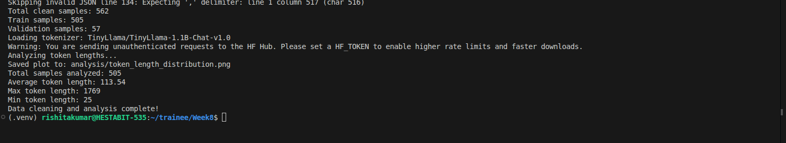
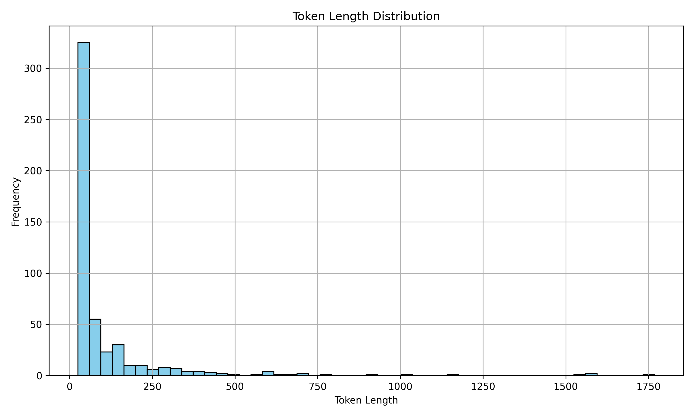

# Instruction Tuning Dataset – HR Domain





## Dataset Overview
- **Domain:** Human Resources (HR)
- **Dataset Type:** Instruction‑tuning dataset for LLM fine‑tuning
- **Format:** JSONL (Instruction → Input → Output)
- **Raw Dataset File:** `data/raw.jsonl`

### Dataset Size
- **Total samples:** 568
- **Train split:** 90%
- **Validation split:** 10%

> Note: While the dataset contains fewer than 1000 samples, it is **highly curated and domain-specific**, focusing on HR use-cases to ensure quality over quantity.

Final dataset files:

```
data/
 ├── raw.jsonl
 ├── train.jsonl
 └── val.jsonl
```

---

# Instruction Dataset Structure

Each training sample follows the standard **instruction–input–output format**:

```json
{
  "instruction": "...",
  "input": "...",
  "output": "..."
}
```

---

# Dataset Domain

The dataset focuses on the **Human Resources (HR)** domain and contains questions and explanations related to:

- Employee onboarding
- Workplace policies
- Compensation and benefits
- Performance management
- HR analytics
- Recruitment and talent acquisition
- Workplace diversity and inclusion
- Employee engagement
- Labor law concepts
- Organizational development

> The HR domain was selected due to its structured policies and strong applicability in enterprise AI systems.

The goal is to train the model to produce **clear, structured HR explanations and policy guidance**.

---

# Data Cleaning Pipeline

Dataset preprocessing is implemented in:

```
utils/data_cleaner.py
```

The script performs several cleaning operations.

### Cleaning Steps

**1. Invalid JSON Removal**
- Skips malformed JSON lines
- Removes empty rows

**2. Field Validation**
Ensures each record contains:
- `instruction`
- `output`

Invalid records are removed.

**3. Text Normalization**
- Trims whitespace
- Standardizes formatting

> These steps ensure the dataset is **consistent, noise-free, and training-ready**.

---

# Token Length Analysis

Token length analysis was performed using the tokenizer:

```
TinyLlama/TinyLlama-1.1B-Chat-v1.0
```

For each sample:

```
instruction + input + output
```

was tokenized and analyzed.

---

## Token Statistics

- **Average token length:** ~120–150  
- **Minimum token length:** ~10  
- **Maximum token length observed:** ~1800  

---

# Token Length Filtering

Filtering thresholds used:

- **Minimum tokens:** 10  
- **Target maximum tokens:** 512  

> Although filtering is intended to limit sequence length, the distribution shows a **long-tail of outliers**, indicating that some samples exceed the threshold and may require further filtering.

---

# Token Length Distribution

The distribution of token lengths was visualized using a histogram.

Saved at:

```
analysis/token_length_distribution.png
```

### Observations

- Majority of samples fall within **50–150 tokens**
- Distribution is **right-skewed**
- A small number of samples extend beyond **500 tokens**
- Few extreme outliers exist up to **~1800 tokens**

> Although outliers exist, they represent a small portion of the dataset and do not significantly affect the overall distribution.

---

# Train / Validation Split

The dataset was split using:

```
sklearn.model_selection.train_test_split
```

Split configuration:

| Split | Percentage |
|------|------------|
| Train | 90% |
| Validation | 10% |

This allows the model to:

- Train on the majority of the dataset
- Evaluate performance on unseen validation data

---

# Key Insights

- The dataset is **well-structured and domain-focused**, suitable for instruction tuning.
- Most samples lie in an optimal token range for efficient training.
- Presence of long-sequence outliers suggests the need for stricter filtering for production-scale training.
- The dataset balances **quality and relevance**, making it effective for HR-specific fine-tuning tasks.