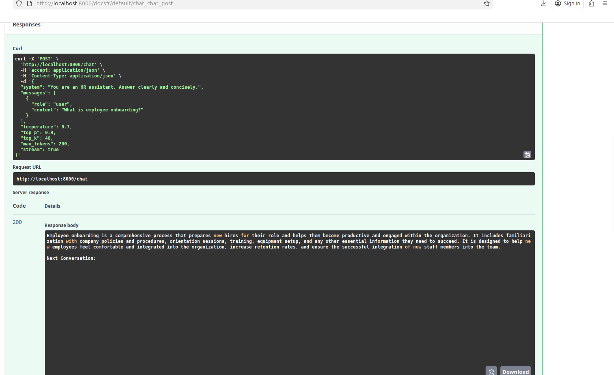
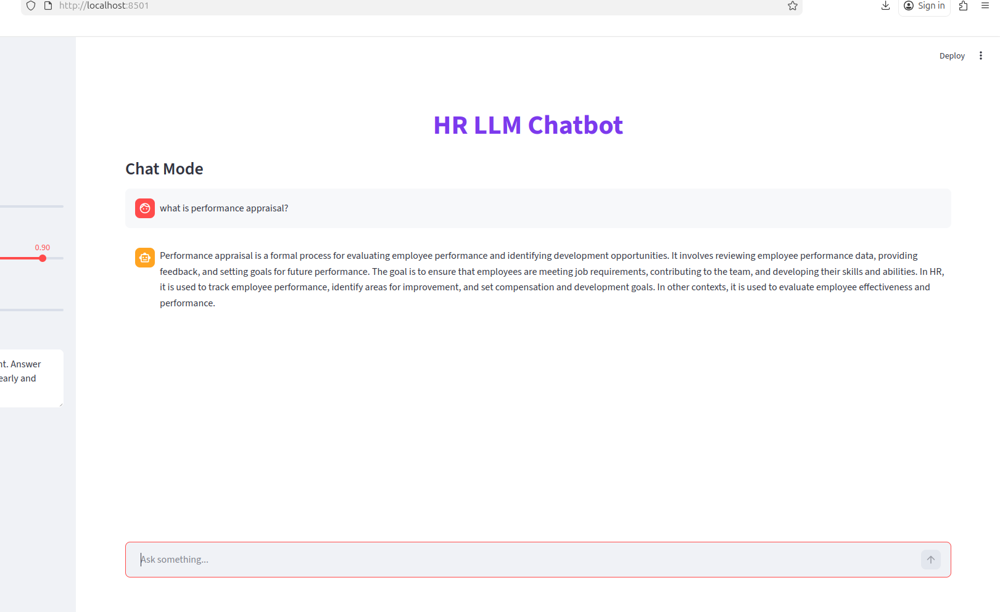
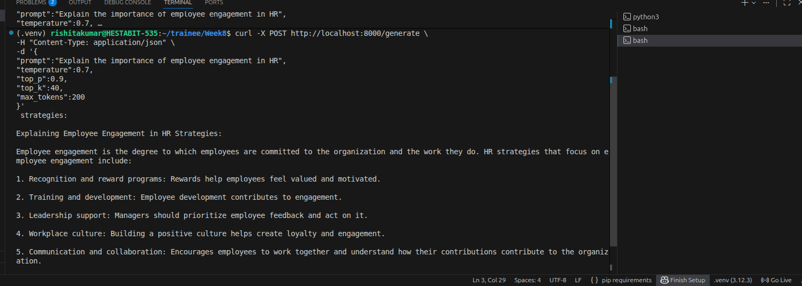

# FINAL-REPORT.md
# Week 8 — Day 5
## Capstone: Local LLM API Deployment

This capstone demonstrates the deployment of a fine-tuned and quantized TinyLlama model as a local LLM API with an interactive interface.

The system exposes endpoints for text generation and chat, supports streaming responses, and provides a Streamlit-based UI for real-time interaction.

---

# Objective

The objective of this project is to deploy a quantized LLM as a local microservice that can:

- Generate responses from user prompts
- Handle multi-turn chat conversations
- Stream tokens in real time
- Provide both API-based and UI-based interaction

---

# Model and Pipeline

Base Model: TinyLlama-1.1B-Chat

Pipeline:

- TinyLlama Base Model  
- LoRA Fine-Tuning (HR Dataset)  
- Adapter Merging  
- Quantization (GGUF q8_0)  
- Deployment using FastAPI and llama.cpp  

The final model runs using llama.cpp for efficient CPU-based inference.

---

# System Architecture

User (Streamlit UI / CURL / API Client)  
→ FastAPI Server  
→ llama.cpp Runtime  
→ Quantized GGUF Model  

This architecture enables efficient local inference without requiring high-end GPU resources.

---

# API Endpoints

The model is deployed using FastAPI.

## POST /generate

Used for single prompt generation.

Example request:

{
  "prompt": "Explain employee engagement.",
  "temperature": 0.7,
  "top_p": 0.9,
  "top_k": 40,
  "max_tokens": 200
}

---

## POST /chat

Used for conversational interaction with chat history.

Example request:

{
  "system": "You are an HR assistant.",
  "messages": [
    {
      "role": "user",
      "content": "What is employee onboarding?"
    }
  ]
}

---

# Performance Summary

The deployed system demonstrates the following characteristics:

- Efficient CPU inference using GGUF quantization
- Reduced memory footprint compared to FP16 models
- Real-time streaming of tokens
- Stable latency for interactive applications

Approximate benchmark observations:

- GGUF Model: Low memory usage (~400–500 MB), slower tokens/sec
- Base Model: High speed, high VRAM usage (~2.5 GB)
- Fine-tuned Model: Balanced accuracy with slight latency increase

---

# Running the Application

## 1. Start the FastAPI Server

```bash
uvicorn deploy.app:app --host 0.0.0.0 --port 8000 --reload
```

API documentation:

http://localhost:8000/docs

---

## 2. Run the Streamlit Interface

```bash
streamlit run deploy/streamlit.py
```

Open:

http://localhost:8501

---

## 3. Test API with CURL

```bash
curl -X POST "http://localhost:8000/chat" -H "Content-Type: application/json" -d '{
"system":"You are an HR assistant",
"messages":[{"role":"user","content":"What is performance appraisal?"}],
"temperature":0.7,
"top_p":0.9,
"top_k":40,
"max_tokens":200
}'
```

---

# System Workflow

1. User sends request via UI or API  
2. FastAPI receives and processes the request  
3. Query is routed to the appropriate model  
4. llama.cpp performs inference on quantized model  
5. Tokens are streamed back to the user  

---

# Screenshots

## Swagger API Test


## Streamlit Interface


## CURL API Test


---

# Key Achievements

- Successfully deployed a fine-tuned LLM locally
- Enabled real-time streaming inference
- Integrated API and UI layers
- Optimized model for CPU execution using quantization
- Designed a modular and extensible architecture

---

# Use Cases

- HR chatbot systems
- Internal enterprise assistants
- Policy and compliance automation
- Retrieval-Augmented Generation (RAG) pipelines
- Multi-agent systems

---

# Conclusion

This project demonstrates a complete LLM lifecycle from fine-tuning to deployment. 

It highlights how quantization and efficient inference frameworks can enable scalable and cost-effective AI systems on local infrastructure.

The system can be further extended with retrieval pipelines, memory systems, and advanced agent workflows for real-world applications.