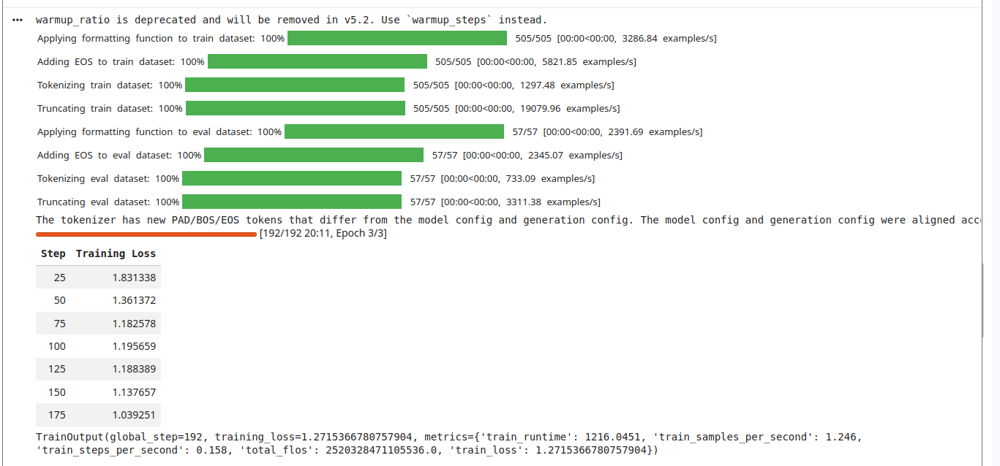
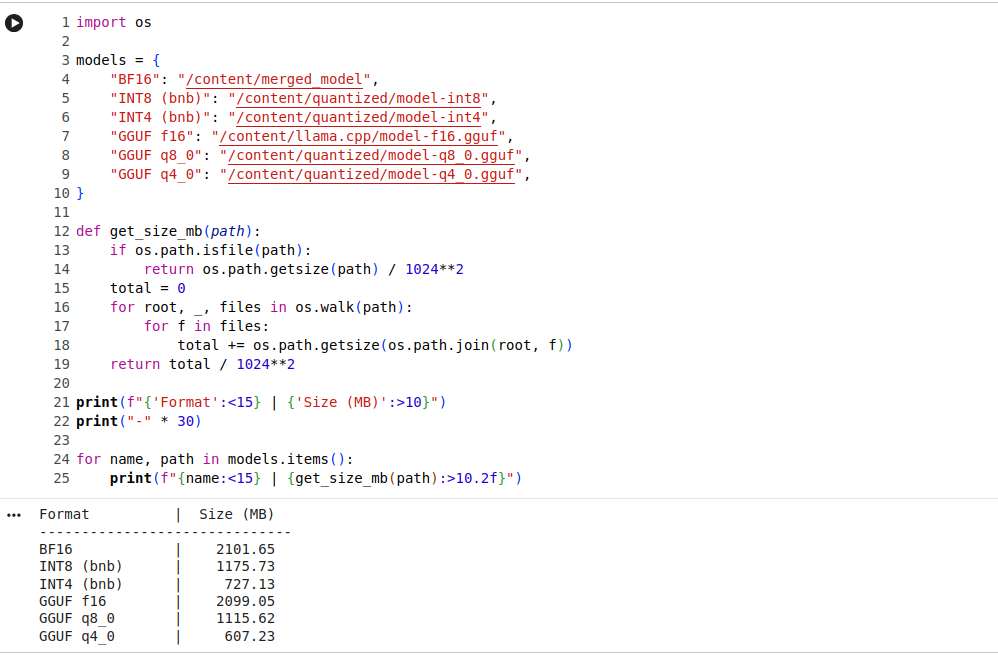
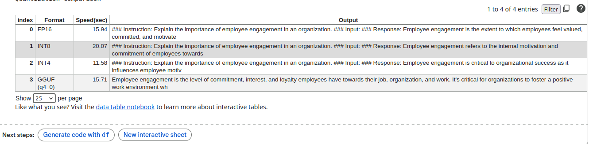
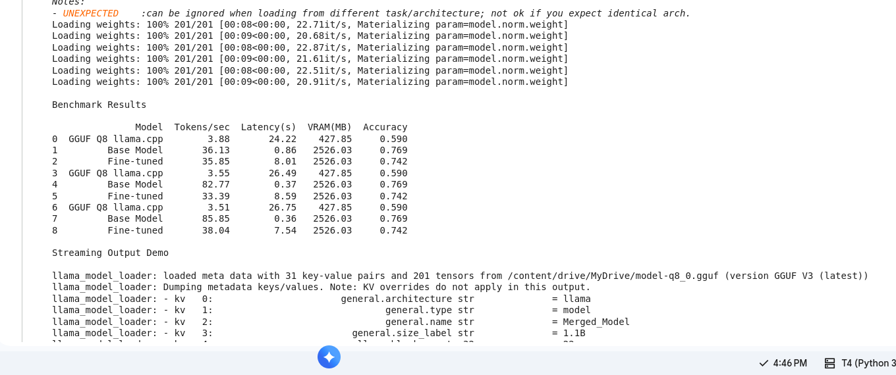

# HR LLM — TinyLlama Fine-Tuning and Deployment

This project demonstrates the end-to-end lifecycle of building, optimizing, and deploying a domain-specific Large Language Model (LLM) using TinyLlama.

The model is fine-tuned on a Human Resources (HR) dataset and optimized for efficient local inference and deployment.

---

# Key Highlights

- Fine-tuned LLM using QLoRA (~1% trainable parameters)
- Achieved significant memory reduction via quantization
- Implemented INT8, INT4, and GGUF quantization
- Built FastAPI-based LLM service with streaming
- Integrated Streamlit UI for interaction
- Benchmarked models using tokens/sec, latency, VRAM, and accuracy

---

# Project Structure

```
week8/
│
├── adapters/
├── analysis/
│   └── token_length_distribution.png
├── benchmarks/
│   └── results.csv
├── data/
│   ├── raw.jsonl
│   ├── train.jsonl
│   └── val.jsonl
├── deploy/
│   ├── app.py
│   ├── config.py
│   ├── model_loader.py
│   └── streamlit.py
├── inference/
│   ├── inference.ipynb
│   └── test_inference.py
├── notebooks/
│   ├── lora_train.ipynb
│   └── quantized.ipynb
├── quantized/
├── utils/
│   ├── data_cleaner.py
│   └── generate_data.py
├── DATASET-ANALYSIS.md
├── TRAINING-REPORT.md
├── QUANTISATION-REPORT.md
├── BENCHMARK-REPORT.md
├── FINAL-REPORT.md
└── README.md
```

---

# Day 1 — Dataset Preparation

An instruction-tuning dataset was prepared for the HR domain.

Topics included:
- employee onboarding
- performance management
- compensation and benefits
- HR analytics
- employee engagement
- recruitment and talent acquisition

Dataset format:

```
{
  "instruction": "...",
  "input": "...",
  "output": "..."
}
```

Dataset files:
```
data/raw.jsonl
data/train.jsonl
data/val.jsonl
```

Cleaning script:
```
utils/data_cleaner.py
```

Run:
```bash
python utils/data_cleaner.py
```

Screenshot:


Token distribution:


---

# Day 2 — QLoRA Fine-Tuning

Base model:
```
TinyLlama/TinyLlama-1.1B-Chat-v1.0
```

Configuration:
- LoRA rank = 16
- learning rate = 2e-4
- batch size = 4
- epochs = 3

Training notebook:
```
notebooks/lora_train.ipynb
```

Run:
```bash
jupyter notebook notebooks/lora_train.ipynb
```

Screenshot:


---

# Day 3 — Model Quantization

Methods used:
- FP16 (baseline)
- INT8
- INT4
- GGUF (llama.cpp)

Results:

| Format | Size |
|------|------|
| FP16 | ~2099 MB |
| INT8 | ~1115 MB |
| INT4 | ~712 MB |
| GGUF q8_0 | ~1100 MB |
| GGUF q4_0 | ~608 MB |

Screenshots:



---

# Day 4 — Benchmarking

Metrics:
- Tokens/sec
- Latency
- VRAM usage
- Accuracy

Run:
```bash
python inference/test_inference.py
```

Result:


---

# Day 5 — Deployment

FastAPI endpoints:
- POST /generate
- POST /chat

Run API:
```bash
uvicorn deploy.app:app --host 0.0.0.0 --port 8000 --reload
```

Run UI:
```bash
streamlit run deploy/streamlit.py
```

Screenshots:


---

# Architecture

User → FastAPI → llama.cpp → Quantized Model

---

# Results

The project demonstrates:
- Dataset preparation and cleaning
- Parameter-efficient fine-tuning
- Model quantization
- Performance benchmarking
- Local LLM deployment

---

# Conclusion

This project showcases a complete pipeline from data preparation to deployment, enabling efficient and scalable LLM applications on local systems.