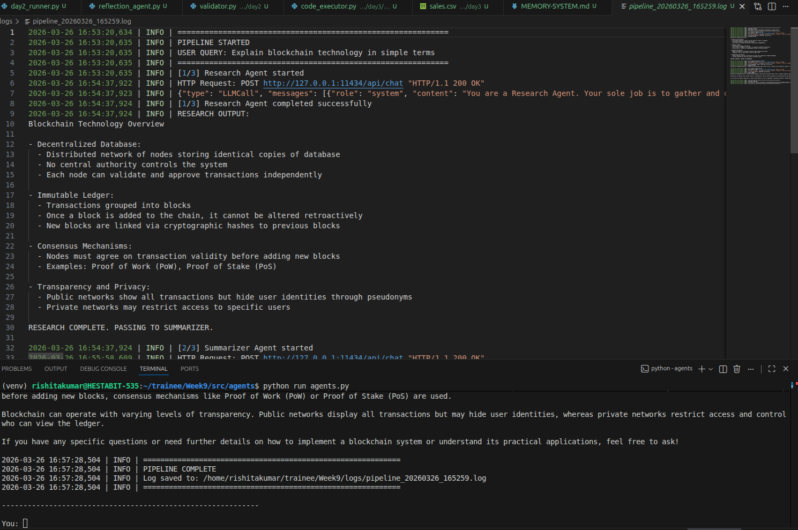
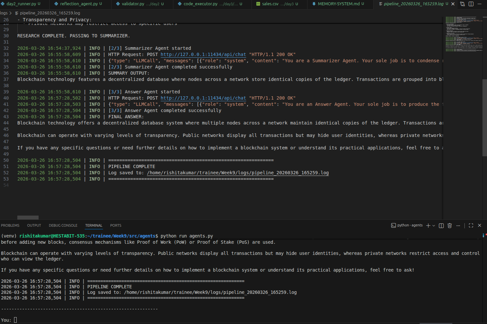
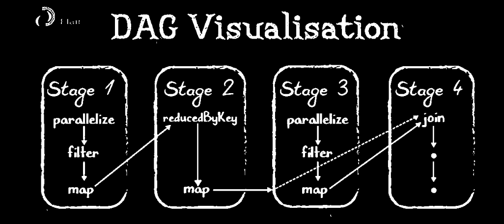
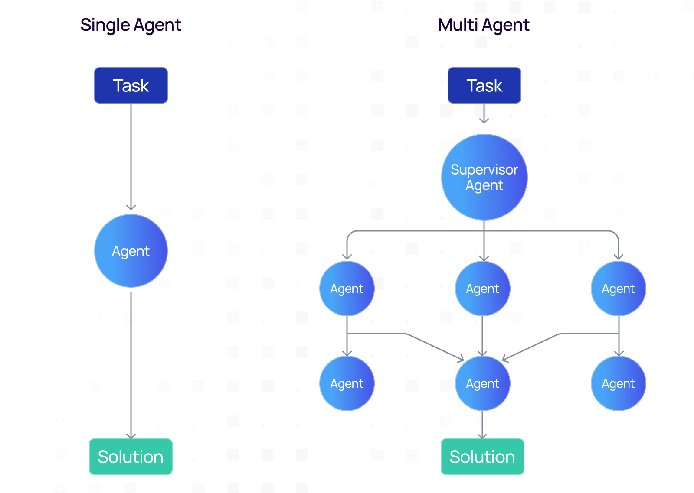

# README.md

## WEEK 9 --- Agentic AI & Multi-Agent System (NEXUS AI)

------------------------------------------------------------------------

## Overview

This project covers the complete journey from building simple AI agents
to designing a fully autonomous multi-agent system. The system evolves
step-by-step across 5 days, introducing concepts like communication,
orchestration, tool usage, memory, and planning.

Reference: Week 9 roadmap fileciteturn14file0

------------------------------------------------------------------------

## Day 1 --- Agent Foundations

### Concepts

-   Single agent design
-   Role-based agents
-   Message-based communication
-   ReAct pattern (Reason + Act)

### Implementation

-   Research Agent
-   Summarizer Agent
-   Answer Agent

### Flow

User → Research → Summarizer → Answer

### Screenshots

------------------------------------------------------------------------

## Day 2 --- Multi-Agent Orchestration

### Concepts

-   Planner → Worker → Validator architecture
-   Task delegation
-   DAG-based execution
-   Parallel processing

### Implementation

-   Planner Agent
-   Worker Agents
-   Reflection Agent
-   Validator Agent

### Flow

User → Planner → Workers → Reflection → Validator → Output

### Screenshots

------------------------------------------------------------------------

## Day 3 --- Tool-Calling Agents

### Concepts

-   Agents using tools (code, files, database)
-   Function calling without APIs
-   System-to-tool execution

### Implementation

-   Code Executor
-   File Agent
-   Database Agent

### Screenshots

     

------------------------------------------------------------------------

## Day 4 --- Memory Systems

### Concepts

-   Short-term memory
-   Long-term memory (SQLite)
-   Vector memory (FAISS)
-   Context retrieval

### Implementation

-   Session memory
-   Vector store
-   Long-term database

### Screenshots

 

------------------------------------------------------------------------

## Day 5 --- Autonomous Multi-Agent System (NEXUS AI)

### Concepts

-   Planner-based execution
-   Multi-agent collaboration
-   Memory-driven reasoning
-   Self-reflection and optimization
-   DAG execution

### Implementation

-   Planner
-   Orchestrator
-   Researcher
-   Analyst
-   Coder
-   Critic
-   Optimizer
-   Validator
-   Reporter

### Architecture

 

### Screenshots

  
  

------------------------------------------------------------------------

## End-to-End Flow

-   User submits query
-   Memory retrieves relevant context
-   Planner generates execution plan
-   Orchestrator executes DAG
-   Agents collaborate
-   Validator verifies output
-   Reporter generates final answer
-   Output saved and returned

------------------------------------------------------------------------

## Final Outcome

By the end of this project:

-   Built multi-agent systems
-   Implemented orchestration and planning
-   Integrated memory systems
-   Created autonomous AI workflows
-   Designed production-ready AI architecture

------------------------------------------------------------------------

## Conclusion

This project demonstrates a complete evolution from basic agents to a
fully autonomous multi-agent AI system capable of solving complex
real-world problems.
