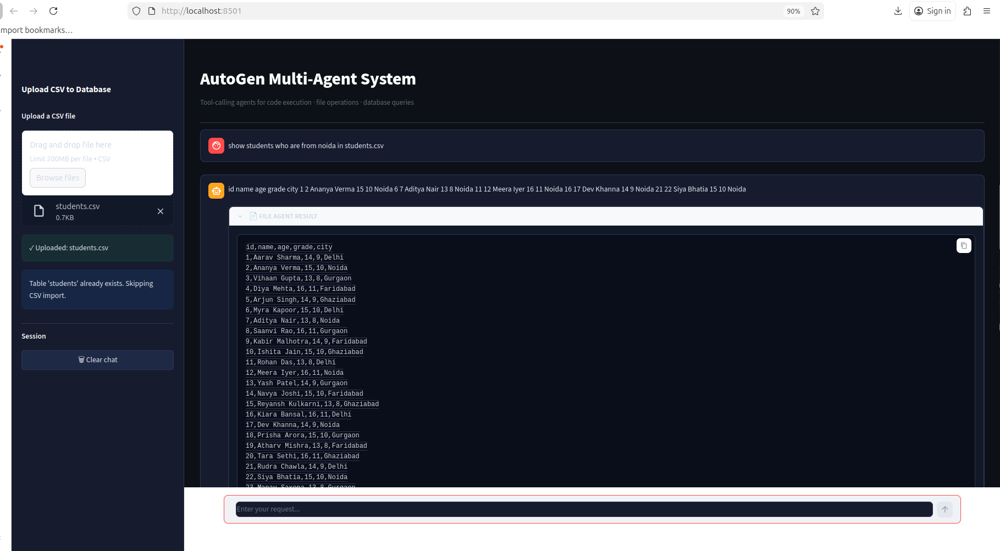
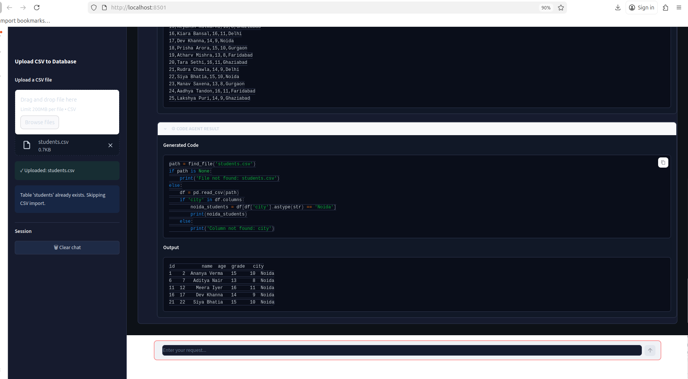
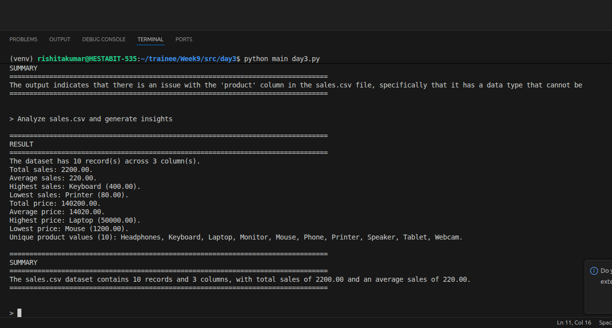
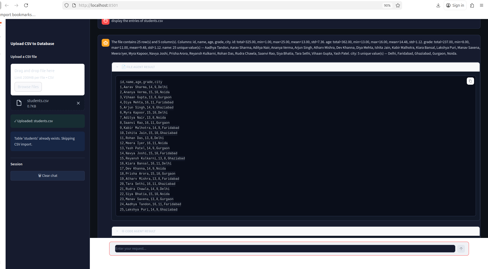
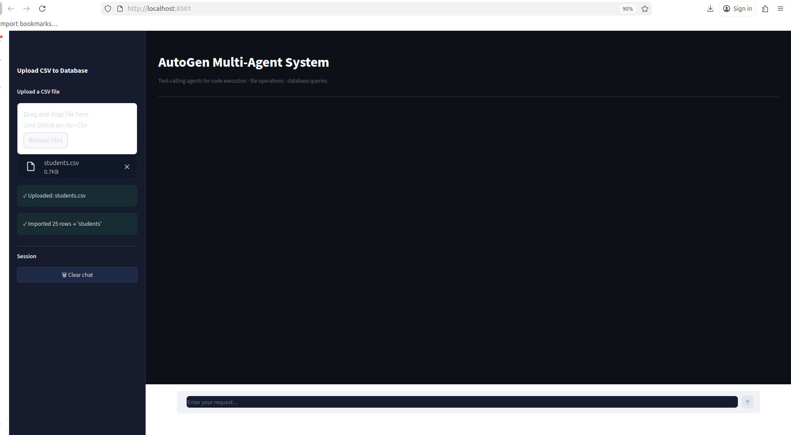
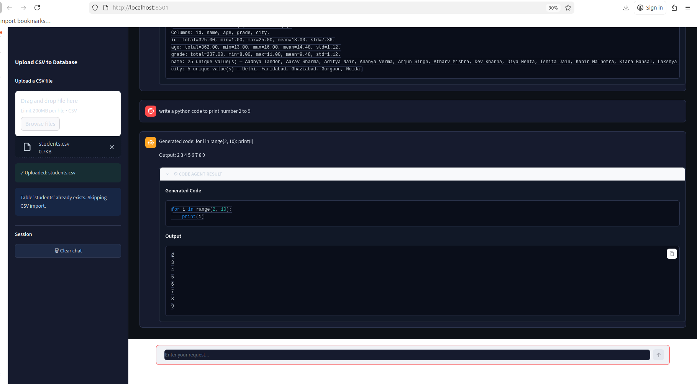

# WEEK 9 --- DAY 3

## Tool-Calling Agents (Code, File, Database)

------------------------------------------------------------------------

## PROJECT STRUCTURE (Screenshots)

------------------------------------------------------------------------

## OVERVIEW

This project implements a tool-calling multi-agent system. The system
does not rely only on language model responses; instead, it routes user
queries to specialized agents that perform real operations such as code
execution, file handling, and database querying.

The architecture ensures that structured tasks are handled
deterministically, while unstructured tasks use the language model.

------------------------------------------------------------------------

## SYSTEM ARCHITECTURE

User → Orchestrator → Agents → Tools → Result → Final Answer

Agents: - Code Executor - File Agent - Database Agent

------------------------------------------------------------------------

## MODEL CLIENT

Defined in model_client.py.

-   Uses GROQ API with LLaMA 3.1 model
-   Configured through environment variables
-   Provides a unified interface for all agents

Reference: fileciteturn11file0

------------------------------------------------------------------------

## FILE AGENT (tools/file_agent.py)

Responsibilities: - Read files - Write files - Handle uploaded files -
Maintain safe directory structure

Key Design: - data/ → read-only sandbox - output/ → write-only sandbox

Features: - Prevents path traversal - Auto-versioning for files - Safe
read/write resolution - Intent-based operation detection

Reference: fileciteturn11file1

------------------------------------------------------------------------

## CODE EXECUTOR (tools/code_executor.py)

Responsibilities: - Execute Python code safely - Handle CSV operations -
Generate CSV data using LLM - Convert CSV to SQLite database

Key Implementations:

1.  Safe Execution:

-   Uses sandboxed environment
-   Captures output using stdout redirection
-   Prevents crashes and unsafe execution

2.  CSV Filtering:

-   Regex-based condition extraction
-   Deterministic filtering logic
-   No dependency on LLM

3.  CSV Summary and Insights:

-   Detects numeric and text columns
-   Computes statistics and summaries

4.  CSV Generation (Important Fix):

-   LLM returns raw CSV text only
-   No Python code generation
-   Prevents syntax and execution errors

5.  Markdown Cleaning:

-   Removes \`\`\`python blocks before execution

Reference: fileciteturn11file3

------------------------------------------------------------------------

## DATABASE AGENT (tools/db_agent.py)

Responsibilities: - Generate SQL queries using LLM - Execute queries on
SQLite database

Features: - Direct query mapping for common tasks - LLM fallback for
complex queries - Blocks unsafe SQL operations (CREATE, DROP, ALTER)

Reference: fileciteturn11file2

------------------------------------------------------------------------

## ORCHESTRATOR (orchestrator/orchestrator.py)

Responsibilities: - Analyze user request - Select appropriate agents -
Execute agents in sequence - Combine outputs into final answer

Routing Logic: - CSV creation → Code → File - CSV analysis → File →
Code - Database query → Database Agent - File operations → File Agent -
Code tasks → Code Agent

Execution Pipeline: - Sequential execution of selected agents - Context
passing between agents - Result synthesis

Reference: fileciteturn11file4

------------------------------------------------------------------------

## CLI RUNNER AND LOGGING (main_day3.py)

Features: - Command-line interaction - Logs stored in logs/day3 -
Summarization of results using LLM

Reference: fileciteturn11file6

------------------------------------------------------------------------

## HOW TOOL-CALLING WORKS IN THIS SYSTEM

Tool-calling is implemented through rule-based orchestration. The
orchestrator analyzes the user query and determines which agent should
handle the task.

Instead of using API-based function calling, the system internally
routes requests to: - Code Executor for computation and CSV logic - File
Agent for file operations - Database Agent for SQL queries

Each agent executes real operations and returns results, which are then
combined.

------------------------------------------------------------------------

## END-TO-END QUERY FLOW

1.  User submits a query
2.  Orchestrator analyzes intent
3.  Appropriate agents are selected
4.  Agents execute tasks:
    -   Code execution
    -   File read/write
    -   Database query
5.  Intermediate results are passed between agents
6.  Final result is synthesized and returned

Example: Query: "Generate employees.csv with 10 rows"

Flow: Code Executor → generates CSV data\
File Agent → writes file

------------------------------------------------------------------------

## KEY FIXES AND IMPROVEMENTS IMPLEMENTED

-   Replaced code-based CSV generation with raw CSV generation
-   Removed markdown artifacts before execution
-   Implemented deterministic CSV filtering
-   Added sandboxed file system (data/ and output/)
-   Introduced auto-versioning for files
-   Improved routing logic in orchestrator
-   Added SQL safety constraints in database agent
-   Implemented logging for debugging and traceability

------------------------------------------------------------------------

## LOGGING (logs/day3)

-   Logs are stored with timestamps
-   Includes:
    -   user query
    -   execution steps
    -   results and summaries

------------------------------------------------------------------------

## CONCLUSION

This project demonstrates a complete tool-calling multi-agent
architecture with clear separation of responsibilities. It integrates
code execution, file handling, and database querying into a unified
system, ensuring reliability, safety, and extensibility.
