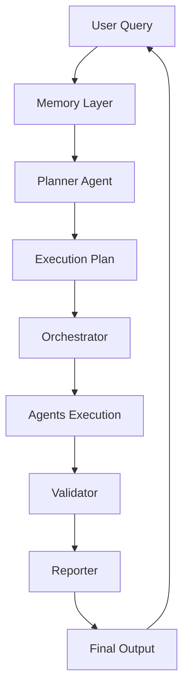
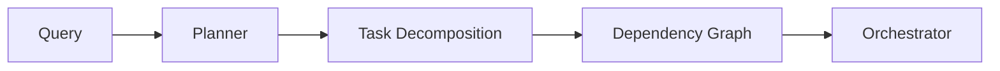
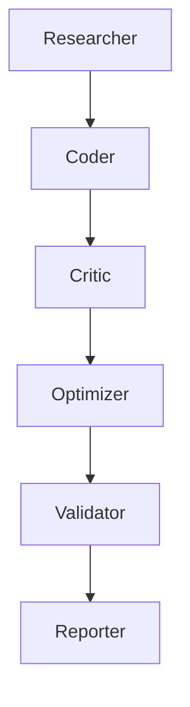
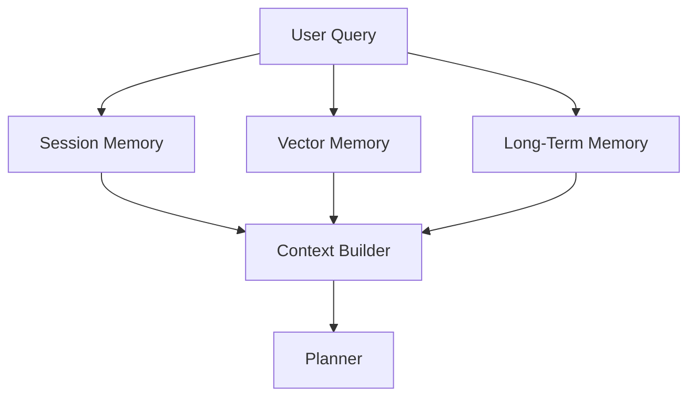
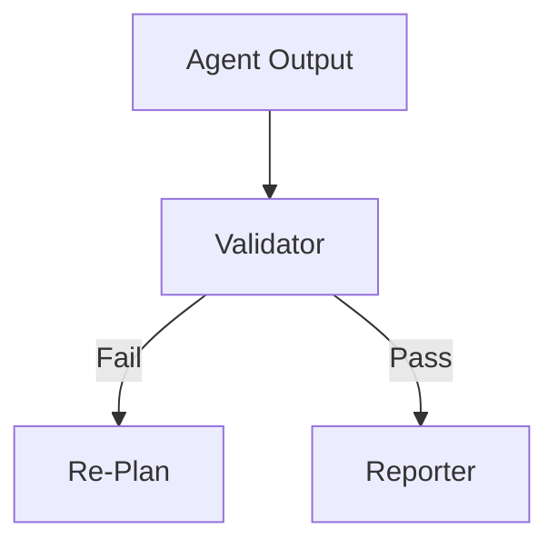

# ARCHITECTURE.md

## NEXUS AI --- Autonomous Multi-Agent System Architecture

------------------------------------------------------------------------

## 1. System Overview

This system implements an autonomous multi-agent architecture where
multiple specialized agents collaborate to solve complex tasks. The
system is designed around planning, orchestration, memory integration,
and iterative improvement.

------------------------------------------------------------------------

## 2. High-Level Flow

------------------------------------------------------------------------

## 3. Planner to Execution Flow

------------------------------------------------------------------------

## 4. Agent Interaction Flow

------------------------------------------------------------------------

## 5. Memory Flow

------------------------------------------------------------------------

## 6. Validation Loop

------------------------------------------------------------------------

## 7. Multi-Agent Architecture

This diagram shows the transition from single-agent to multi-agent
systems.

-   A supervisor (Planner/Orchestrator) controls execution\
-   Tasks are divided among multiple agents\
-   Agents collaborate and produce a final solution

------------------------------------------------------------------------

## 8. DAG-Based Execution

-   Tasks are broken into stages\
-   Dependencies are maintained\
-   Parallel execution is possible\
-   Final results are merged

------------------------------------------------------------------------

## 9. Core Components

### Planner Agent

-   Generates execution plan\
-   Defines agent roles\
-   Creates dependency graph

### Orchestrator

-   Executes DAG\
-   Manages agent order\
-   Handles retries

### Agents

-   Researcher → gathers knowledge\
-   Analyst → processes data\
-   Coder → generates code\
-   Critic → finds issues\
-   Optimizer → improves output\
-   Validator → verifies correctness\
-   Reporter → generates final response

------------------------------------------------------------------------

## 10. Memory Architecture

-   Session Memory → recent interactions\
-   Vector Memory → semantic search (FAISS)\
-   Long-Term Memory → SQLite storage

Flow: Query → Memory → Context → Planner → Execution

------------------------------------------------------------------------

## 11. Execution Flow

-   User submits query\
-   Memory retrieves context\
-   Planner creates plan\
-   Orchestrator executes DAG\
-   Agents collaborate\
-   Validator checks\
-   Reporter generates output\
-   Output saved and returned

------------------------------------------------------------------------

## 12. Logging and Output

-   Logs stored in logs/day5\
-   Tracks execution steps and retries\
-   Outputs saved to output directory

------------------------------------------------------------------------

## 13. Key Design Principles

-   Modular agent design\
-   Separation of planning and execution\
-   Memory-driven reasoning\
-   Iterative improvement loop

------------------------------------------------------------------------

## 14. End-to-End Summary

-   Query received\
-   Context injected\
-   Plan generated\
-   Agents executed\
-   Validation performed\
-   Final response generated

------------------------------------------------------------------------

## Conclusion

This architecture demonstrates a scalable, autonomous multi-agent
system.
