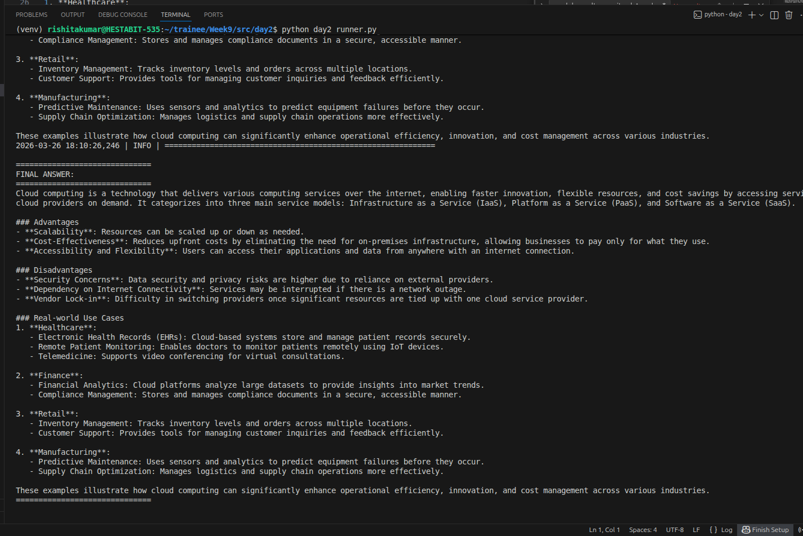
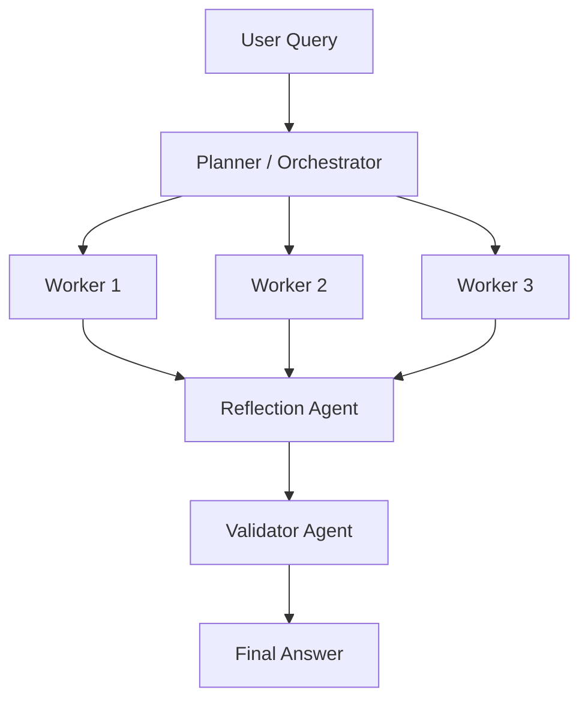
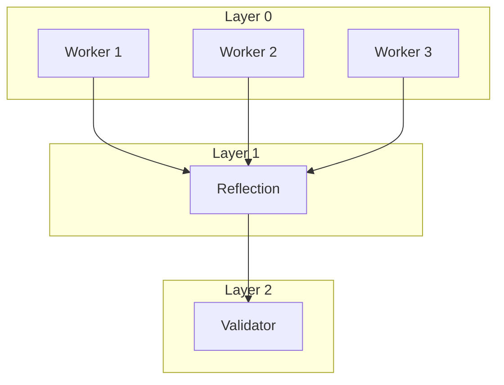
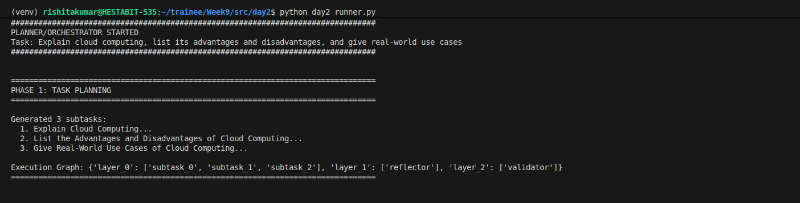
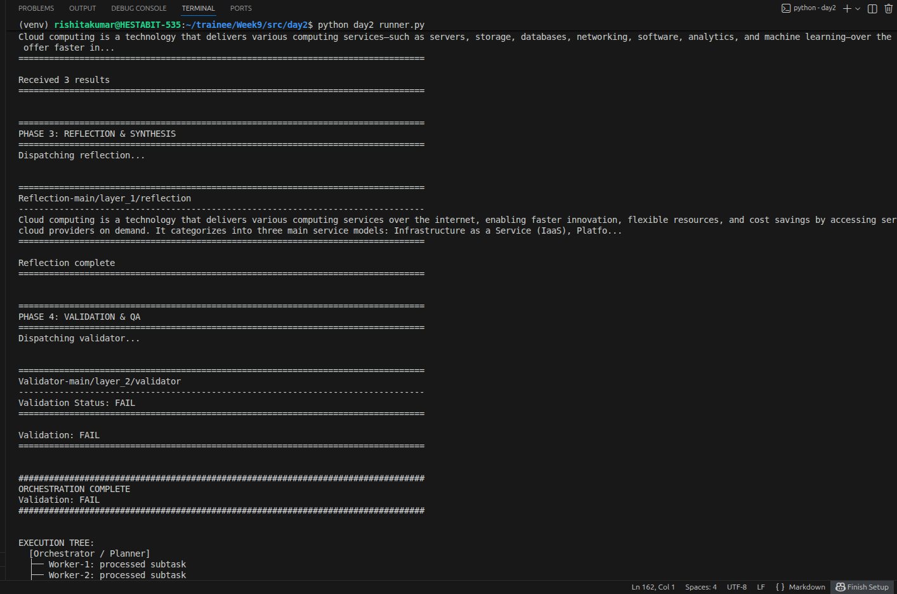
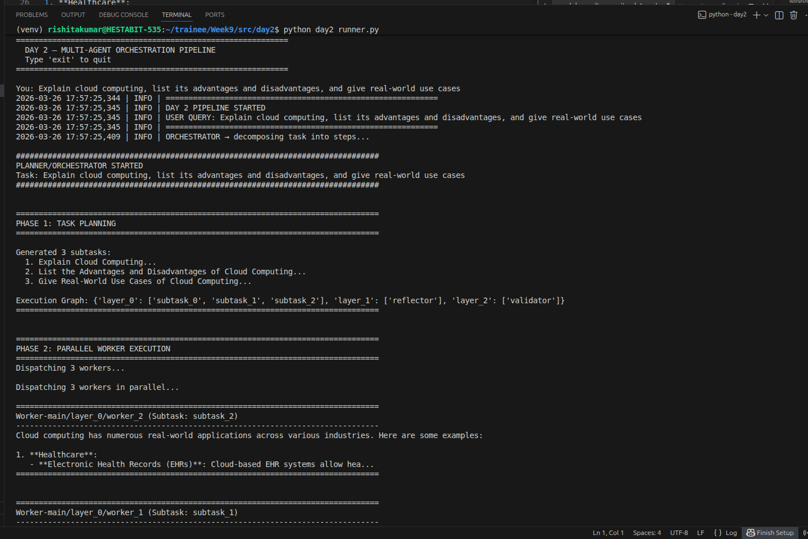

# AGENT ORCHESTRATION — DAY 2

## Overview

This document describes the implementation of a multi-agent orchestration system developed in Day 2. The system extends the Day 1 pipeline by introducing planning, parallel execution, reflection, and validation.

Pipeline:
User → Planner → Worker Agents (Parallel) → Reflection Agent → Validator → Final Answer

This system demonstrates task decomposition, parallel execution, result synthesis, and validation.

---

## Concepts Implemented

- Task decomposition
- Parallel execution
- Reflection (result synthesis)
- Validation (quality assurance)
- DAG-based execution
- Message-based communication

---

## System Overview
Planner–Executor architecture using DAG-based execution.

Flow:
User → Planner → Workers (Parallel) → Reflection → Validator → Final Answer

## High-Level Flow

## DAG Execution

## Execution Tree
User Query
└── Planner
    ├── Worker 1
    ├── Worker 2
    ├── Worker 3
    └── Reflection
        └── Validator
            └── Final Answer

## Components
- Planner → Task decomposition
- Workers → Parallel execution
- Reflection → Synthesis
- Validator → QA check

## Key Features
- Parallel execution
- DAG pipeline
- Modular agents
- Structured communication

## Project Structure

src/
 └── orchestrator/
      ├── planner.py
      ├── messages.py
      ├── reflection_agent.py
      ├── validator.py
      └── worker_agent.py

day2_runner.py

logs/
 └── day2/

---

## Planner Agent

File: orchestrator/planner.py

Role:
- Breaks task into subtasks
- Creates execution flow

Behavior:
- Generates 3 subtasks
- Defines layers:
  workers → reflection → validation

Screenshot:

---

## Worker Agents

File: worker_agent.py

Role:
- Execute subtasks

Behavior:
- Runs in parallel
- Uses full context
- Produces partial outputs

---

## Reflection Agent

File: reflection_agent.py

Role:
- Combine worker outputs

Behavior:
- Synthesizes results
- Improves quality

Screenshot:

---

## Validator Agent

File: validator.py

Role:
- Validate final result

Behavior:
- Outputs PASS / FAIL
- Ensures correctness

---

## Message System

File: orchestrator/messages.py

Defines communication:

- UserTask
- TaskPlan
- WorkerTask / WorkerResult
- ReflectionTask / ReflectionResult
- ValidationTask / ValidationResult
- FinalAnswer

---

## Execution Pipeline

File: day2_runner.py

Steps:

1. User query received
2. Planner decomposes task
3. Workers run in parallel
4. Reflection combines results
5. Validator checks output
6. Final answer returned

Logs:
- Stored in logs/day2/
- Timestamped files generated

Screenshot:

---

## Key Observations

- Parallel processing improves efficiency
- Planner ensures structured execution
- Reflection improves output quality
- Validator enforces correctness
- Message system enables modular design

---

## Conclusion

The Day 2 system successfully implements a scalable multi-agent orchestration pipeline. It enhances performance and quality compared to Day 1 by introducing planning, parallel execution, reflection, and validation.

