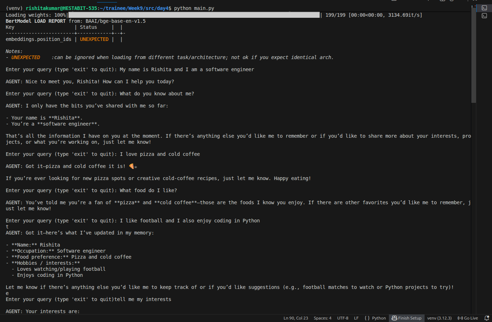
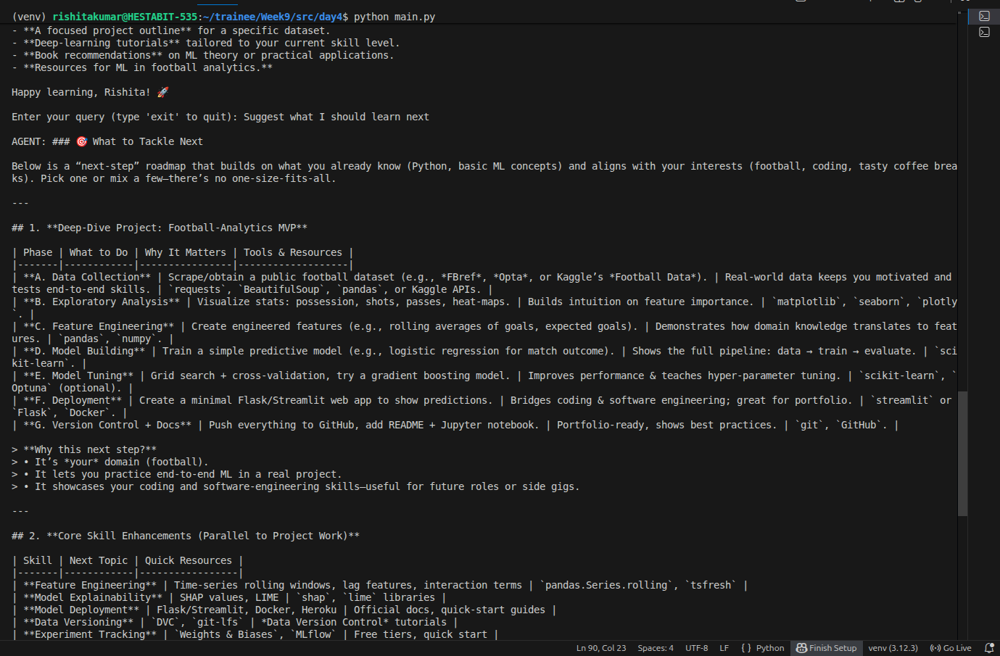

# DAY 4 — MEMORY-POWERED AGENT 

## 1. Executive Summary

Day 4 introduces a **persistent memory architecture** into the agent system, transforming it from a stateless assistant into a context-aware intelligent system capable of remembering past interactions.

Unlike previous days, where each query was independent, this system enables:
- Long-term recall
- Personalized responses
- Context-aware reasoning

The architecture combines:
- Session Memory (short-term)
- Vector Memory (semantic search)
- Long-Term Memory (persistent storage)

---

## 2. System Architecture

The complete pipeline is:

User Input  
→ Retrieve Memory Context  
→ Inject into Agent Prompt  
→ Generate Response  
→ Store Interaction  
→ Update Memory  

Reference: fileciteturn21file0

---

## 3. Core Memory Components

### 3.1 Session Memory

File: session_memory.py fileciteturn21file5

This component stores recent conversation history.

Key Features:
- Rolling buffer of messages
- Stores both user and agent messages
- Provides immediate conversational context

Implementation:
- Uses in-memory list
- Returns last N messages (default 10)

---

### 3.2 Vector Store (Semantic Memory)

File: vector_store.py fileciteturn21file6

This layer enables semantic retrieval using embeddings.

Key Features:
- Uses SentenceTransformer (BAAI/bge-base-en-v1.5)
- FAISS index for fast similarity search
- Stores embeddings mapped to memory IDs

Flow:
Text → Embedding → FAISS Index → Similarity Search

---

### 3.3 Long-Term Memory (Persistent Layer)

File: long_term_store.py fileciteturn21file3

This layer stores structured memory in SQLite.

Schema:
- id
- fact
- category
- importance
- timestamp

Capabilities:
- Store facts
- Retrieve by ID
- Delete outdated facts

---

## 4. Memory Manager (Core Brain)

File: memory_manager.py fileciteturn21file4

This is the most important component of Day 4.

### Responsibilities:
- Coordinate all memory layers
- Extract meaningful facts from conversations
- Store only relevant long-term information
- Retrieve relevant memory during queries

---

## 5. Memory Storage Pipeline

### Step 1: Interaction Storage

After every query:

store_interaction(user, agent)

Process:
1. Save messages to session memory
2. Send conversation to LLM summarizer
3. Extract structured facts

---

### Step 2: Fact Filtering

Only facts with:

importance >= 0.5

are stored.

This prevents noise and irrelevant data storage.

---

### Step 3: Reconciliation Logic

Before storing new facts, system checks:

- Duplicate
- Contradiction
- Update
- Merge possibility

Thresholds:
- SIM_THRESHOLD = 0.80
- DUP_THRESHOLD = 0.93

Behavior:
- Duplicate → Ignore
- Contradiction → Replace old
- Mergeable → Combine facts

---

### Step 4: Storage

Final facts are stored in:
- FAISS index (vector layer)
- SQLite database (long-term storage)

---

## 6. Memory Retrieval Pipeline

When user sends a query:

retrieve_context(query)

Process:
1. Fetch recent session messages
2. Perform vector search (top-k)
3. Fetch facts from SQLite
4. Combine into prompt

Output format:

SESSION MEMORY: ...
RELEVANT FACTS: ...

---

## 7. Agent Integration

File: main.py fileciteturn21file0

The agent receives:

MEMORY CONTEXT + USER QUERY

It uses memory only if relevant.

Important Design:
- Memory is optional, not forced
- Prevents hallucination from irrelevant memory

---

## 8. Logging System

Logs stored in:

logs/day4/

Each entry contains:
- Timestamp
- User query
- Agent response
- Execution time

This enables debugging and performance tracking.

---

## 9. Database Inspection Utility

File: sqlite_lookup.py fileciteturn21file2

Used to:
- View stored memories
- Inspect database entries
- Debug stored facts

---

## 10. Screenshots

### Output View

### Alternate Output

---

## 11. Real Execution Flow Example

### Query:
"Remember that I like Python"

Flow:
1. Stored in session memory
2. Extracted as fact
3. Stored in vector + SQLite

Later Query:
"What language do I like?"

Flow:
1. Vector search retrieves fact
2. SQLite fetches full text
3. Agent answers correctly

---

## 13. Strengths

- Hybrid memory architecture
- Efficient semantic search
- Noise filtering using importance
- Safe reconciliation logic
- Persistent storage

---

## 14. Limitations

- LLM dependency for summarization
- No memory decay strategy
- No multi-user separation
- Limited context window

---

## 15. Conclusion

Day 4 introduces a fully functional memory system, enabling the agent to transition from stateless responses to intelligent, context-aware interactions.

This is a critical milestone toward building **autonomous AI systems with memory and learning capabilities**.
