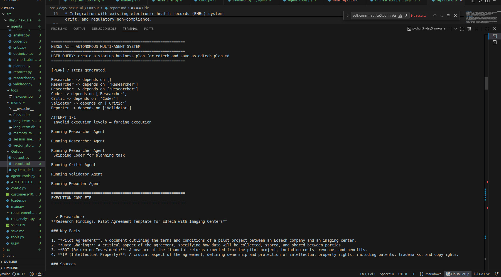
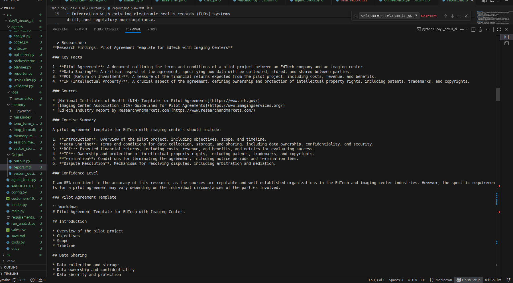
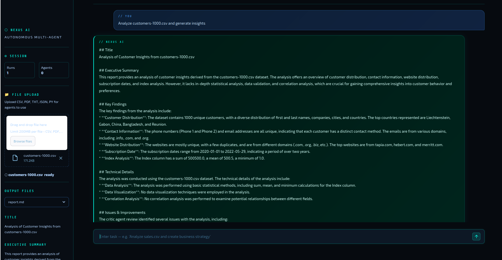
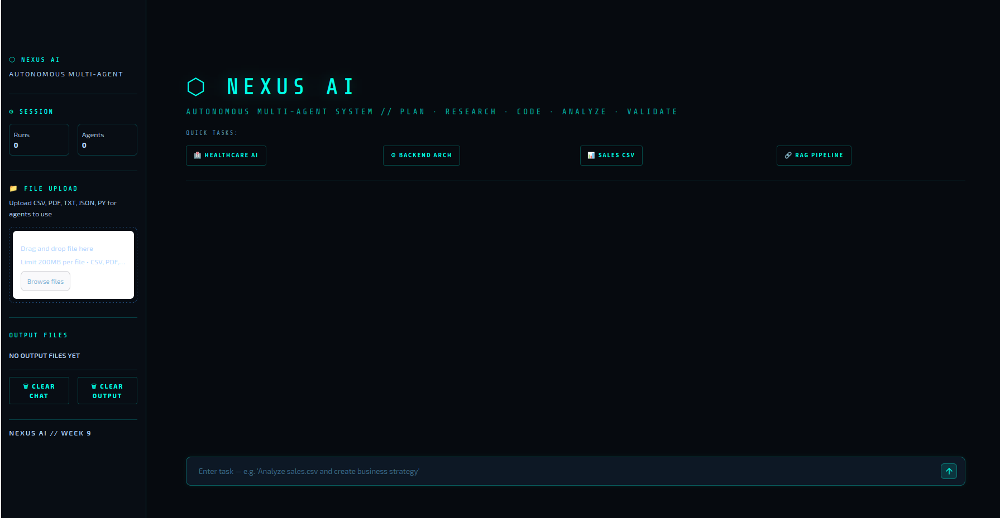
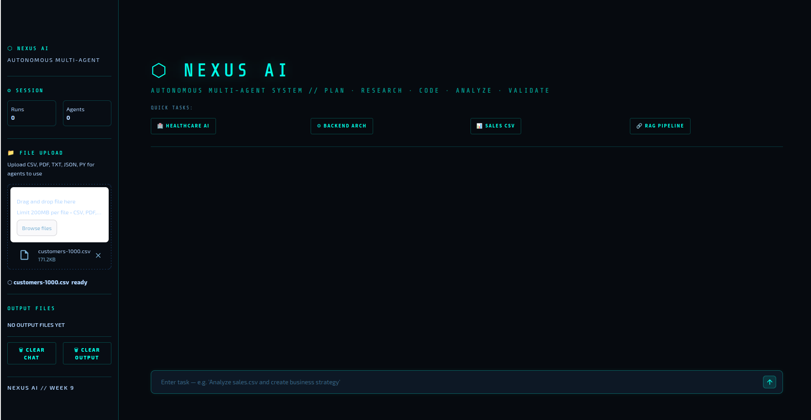

# WEEK 9 --- DAY 5

## Autonomous Multi-Agent System (NEXUS AI)

------------------------------------------------------------------------

## PROJECT STRUCTURE (Screenshots)

 
 
 
 
 

------------------------------------------------------------------------

## OVERVIEW

This project implements a fully autonomous multi-agent system (NEXUS AI)
where multiple specialized agents collaborate to solve complex user
queries.

Unlike Day 3 (tool-calling), this system introduces: - Planning (Planner
Agent) - Multi-agent reasoning (Researcher → Coder → Critic → etc.) -
Memory (short-term + long-term) - Autonomous execution loop with retries

------------------------------------------------------------------------

## LLM CLIENT

Custom wrapper for GROQ model:

-   Uses OpenAI-compatible client
-   Supports function calling
-   Configurable via environment variables

Key design: - Centralized model access - Shared across all agents -
Ensures consistency

------------------------------------------------------------------------

## AGENT ARCHITECTURE

Agents implemented:

-   Planner → creates execution plan
-   Researcher → gathers knowledge
-   Analyst → handles data/CSV tasks
-   Coder → generates code
-   Critic → finds issues
-   Optimizer → improves output
-   Validator → verifies correctness
-   Reporter → generates final report

Example: Analyst agent strictly follows tool rules and only calls tools
when filename exists fileciteturn12file0

------------------------------------------------------------------------

## PLANNER (Core Innovation)

Planner generates structured execution plan:

-   Uses JSON schema (ExecutionPlan)
-   Assigns agents
-   Defines dependencies
-   Ensures no cycles

Rules: - Coding → Researcher → Coder → Critic → Optimizer → Validator →
Reporter - Data → Analyst → Critic → Validator → Reporter

Reference: fileciteturn12file8

------------------------------------------------------------------------

## ORCHESTRATOR

Central brain of system.

Responsibilities: - Execute plan using DAG - Manage dependencies - Run
agents level-by-level - Maintain context - Handle retries

Key Features:

1.  DAG Execution

-   compute_levels() builds execution layers
-   parallel execution possible

2.  Context Passing

-   compress_context() sends previous outputs

3.  Error Handling

-   retry loop with planner regeneration

4.  Output Saving

-   Extract files from coder output
-   Save reports and code

Reference: fileciteturn12file4

------------------------------------------------------------------------

## MEMORY SYSTEM

Three-layer memory:

1.  Session Memory

-   Stores recent messages fileciteturn12file11

2.  Vector Store

-   FAISS-based semantic search fileciteturn12file12

3.  Long-Term Memory

-   SQLite-based storage fileciteturn12file9

Memory Manager: - Extracts facts using LLM - Stores high-importance
facts - Retrieves relevant context for planning

Reference: fileciteturn12file10

------------------------------------------------------------------------

## AGENT ROLES (WHAT YOU IMPLEMENTED)

Researcher: - Collects structured knowledge fileciteturn12file6

Coder: - Generates full production-ready code - Multi-file output
support fileciteturn12file1

Analyst: - Uses tools for CSV analysis - Strict tool usage rules
fileciteturn12file0

Critic: - Finds logical gaps and risks fileciteturn12file2

Optimizer: - Improves performance and efficiency fileciteturn12file3

Validator: - Final correctness check fileciteturn12file7

Reporter: - Generates structured markdown report fileciteturn12file5

------------------------------------------------------------------------

## TOOL SYSTEM

Agent tools defined centrally: - CSV summary - File reading - Directory
listing

Example: Analyst tools include get_csv_summary and read_csv
fileciteturn12file13

------------------------------------------------------------------------

## EXECUTION FLOW (END-TO-END)

1.  User enters query (CLI or Streamlit)
2.  Memory context is retrieved
3.  Planner generates execution plan
4.  Orchestrator executes agents:
    -   Based on dependencies
    -   In DAG order
5.  Each agent:
    -   Receives context
    -   Produces output
6.  Results stored in memory
7.  Outputs saved (code/report)
8.  Reporter generates final answer

------------------------------------------------------------------------

## KEY FIXES AND IMPROVEMENTS

-   Implemented DAG-based execution (parallel-ready)
-   Added planner for dynamic routing
-   Introduced retry mechanism on validation failure
-   Built structured memory system
-   Extracted multi-file outputs from coder
-   Added safe file saving logic
-   Improved context compression
-   Added strict agent responsibilities

------------------------------------------------------------------------

## LOGS (logs/day5)

Example logs include: - planner: plan_generated - agent execution
success/failure - retry attempts - output saving logs

Logs help debug: - agent failures - invalid plans - memory usage

------------------------------------------------------------------------

## FINAL END-TO-END SUMMARY

-   User query received
-   Memory context injected
-   Planner creates execution graph
-   Orchestrator executes agents via DAG
-   Agents collaborate:
    -   Researcher → knowledge
    -   Coder → implementation
    -   Critic → validation
    -   Optimizer → improvement
    -   Validator → correctness
    -   Reporter → final output
-   Memory updated
-   Files saved automatically

------------------------------------------------------------------------

## CONCLUSION

Day 5 extends the system from tool-calling to full autonomous AI
orchestration.

The system demonstrates: - multi-agent collaboration - planning +
execution separation - memory-driven intelligence - scalable
architecture

This is a production-level foundation for autonomous AI systems.

Full-flow 

User submits a query through CLI or Streamlit UI
System retrieves relevant context from memory:
Session memory (recent interactions)
Vector memory (semantic search using FAISS)
Long-term memory (stored facts in SQLite)
Query + memory context is passed to the Planner Agent
Planner Agent:
Analyzes the task
Generates a structured execution plan (JSON)
Assigns agents (Researcher, Analyst, Coder, etc.)
Defines dependencies between agents
Execution plan is converted into a Directed Acyclic Graph (DAG)
Orchestrator starts execution:
Reads the DAG
Executes agents level-by-level
Allows parallel execution where possible
For each agent execution:
Receives compressed context from previous steps
Performs its specific task
Agent responsibilities:
Researcher → gathers required knowledge
Analyst → processes CSV/data using tools
Coder → generates executable code
Critic → identifies issues or gaps
Optimizer → improves efficiency/structure
Validator → verifies correctness
Reporter → generates final structured output
After each step:
Output is stored in shared context
Memory is updated with useful information
Validation phase:
If output is incorrect → triggers re-planning
Orchestrator retries with improved plan
Output handling:
Extracts files from coder output (code, reports)
Saves files to output directory
Logging:
Each step recorded in logs/day5
Includes execution flow, errors, retries
Final stage:
Reporter compiles all results
Generates final response
System returns final answer to user

